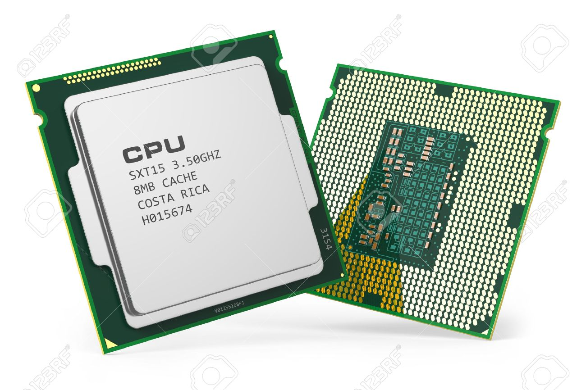
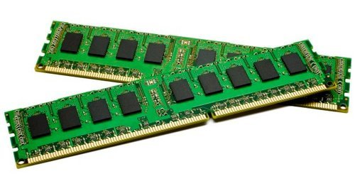
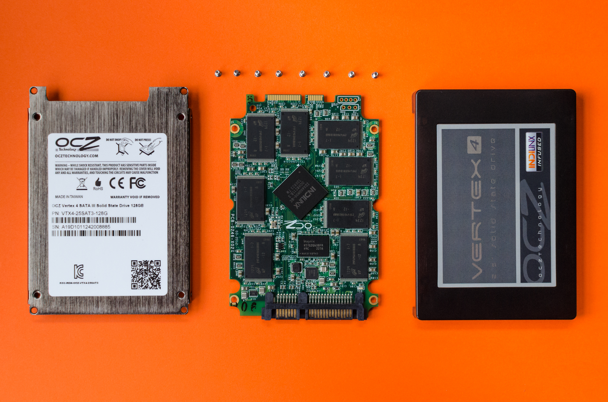
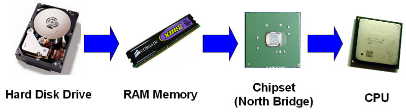

1주차
- 사전 지식 확인
- 컴퓨터의 이해
- 프로그래밍 언어란?
> 이진법, 기계어, 프로그래밍 언어란?

- 개발툴 설치 : 미리 해오시면 좋습니다
- Java의 기초
> 변수, 함수, if, else 이해하기


- 미니프로젝트 
> Java로 계산기 만들기
>
> Java로 간단한 채팅 하기 

- 안드로이드 체험하기
>  안드로이드 앱을 아주 간단히 만들어서 폰에 설치해봅니다. 


## 0. 사전 지식 확인
얼마나 컴퓨터랑 친숙한지를 알기 위한 퀴즈입니다. 부담 없이 대답해주세요!

1. 나는 확장자(extension)가 무엇인지 알고 있다. txt, jpg, exe, dmg의 차이를 안다

2. 나는 소프트웨어와 하드웨어의 차이점을 안다.

3. 나는 폴더, 파일를 구분할 줄 안다.

4. 나는 CPU, RAM, Hard Drive의 차이점을 안다.
  - 4.1 내 컴퓨터의 CPU 성능과 RAM 크기를 안다.

5. 나는 터미널, 커맨드 라인이 무엇인지 들어봤다.

6. 나는 운영체제(OS)와 응용 소프트웨어(일반 소프트웨어, Application Software)의 차이점을 안다.

7. 노트북이나 스마트폰을 열어본 적이 있거나, 데스크탑을 조립해본 적이 있다.


혹시 모르는 질문이 있더라도 차차 배우다보면은 알게 될거에요!


## 1. 컴퓨터의 이해
우린 완성되어 있는 컴퓨터만 보면서 살아갑니다. 그러다 보니 컴퓨터는 하나의 마법처럼만 보입니다. 하지만 크기나 모양에 상관없이 구조는 동일합니다.  

사람이 남자,여자,아이,노인,백인,흑인이더라도 사람이라는 점에서 동일하듯이,
노트북, 스마트폰, 드론, 로봇, 무인자동차 모두 다 컴퓨터입니다.

그럼 컴퓨터는 무엇으로 이뤄져 있을까요?
크게 3가지로 나뉩니다.

CPU, RAM, HARD DISK(SSD) 이지요.
이 세가지의 역할만 이해하면 컴퓨터의 원리를 알 수 있습니다. (다나와에서 노트북 살때도 도움이 됩니다. )

### 1.1.1 CPU (Central Processing Unit, 중앙 처리 장치)

- CPU는 고속 계산장치인데요. 사람의 뇌와 같은 역할을 합니다. 단순히 고속 계산 장치라고 하면은 감이 안 올 텐데요. CPU는 보통 Hz(헤르츠)라는 단위로 표시하는데 1초당 깜빡이는 횟수를 나타냅니다.

- 저렴한 20만원 짜리 노트북의 경우 1.8 GHz(기가 헤르츠)의 CPU를 쓰는데요. 기가 헤르츠가 10^9(1억)이니 1억번이나 깜빡인다고 할 수 있습니다. 작은 칩 속에 놀라운 비밀이 있는 것이죠.

- CPU는 덧셈, 뺄쎔을 엄청나게 빠른 속도로 하는 기계입니다. 다른 거는 하나도 못합니다. CPU는 이진법으로 밖에 계산을 못합니다. 0과 1만 이해할 수 있는 거죠. 어떻게 보면 멍청한 기계인데, 이 기계를 기반으로 인공지능을 만든다니 놀랍지 않나요?

- 인텔이 CPU를 만든 덕분에 세계에서 가장 큰 기업이 되었지요. 그만큼 CPU는 중요합니다.

- 손정의 소프트뱅크 회장이 투자한 ARM(35조에 인수)은 모바일용 CPU를 설계하는 회사입니다. CPU가 얼마나 IT업계에서 중요한지 알 수 있지 않나요?

### 1.1.2 RAM(Random Access Memory, 램)

- RAM은 임시 기억 장치인데요. CPU가 하려는 값을 잠시 저장했다가 CPU에서 계산할 때 씁니다. 우리도 외워야할 영어 단어나, 할 일을 종이에 적거나 스마트폰에 적어두듯이 컴퓨터도 할 일을 다른 데 적어두는 거죠. 그게 바로 RAM입니다.

- RAM은 왜 필요할까요? 다 CPU에서 하면은 편할텐데 굳이 RAM을 만들어 머리 아프게 하는 걸까요?
바로 경제적 이유때문입니다. CPU는 만들기도 어렵고 가격이 비쌉니다. 한때는 전세계에서 2개의 회사만 만들정도로 독점이 심했습니다.

- 결국 RAM은 비싼 CPU를 효율적으로 쓰기 위해 만들어졌습니다.

- RAM은 큰 문제가 있는데 전원을 끄면은 저장된 게 사라집니다. 잠깐 밖에 기억을 못합니다. 문서나 PPT 작업을 하다가 날아간 기억이 있으시죠? 이게 다 RAM에다만 저장을 해서 생긴 일입니다. 이를 해결하고자 나온 게 하드 디스크입니다.

### 1.1.3 HARD DISK(하드 디스크, 보통 SSD)

- 하드 디스크는 영구 기억 장치인데요. 한번 저장된 데이터는 물리적 충격이 없는 이상 계속 보존됩니다. 하드 디스크를 집어 던지거나, 강하게 때리지 않는 이상 데이터를 보관, 저장합니다. 뇌의 장기 기억과 비슷하죠. 어렸을 떄 배운 외국어나, 수학공식은 시간이 지나도 안 까먹잖아요. 그게 다 장기 기억으로 옮겨갔기 때문입니다.

- 얼핏 봐도 하드 디스크가 제일 좋아보이는데 왜 굳이 RAM을 쓸까요? 바로 속도 문제입니다. RAM에 비하면 하드 디스크는 굼뱅이 수준이거든요. CPU가 바로 하드디스크에서 데이터를 찾아야 했다면 컴퓨터 켜는 데만도 1시간은 걸렸을 거에요.

### 1.1.4 CPU, RAM, HARD DISK의 연관성


문서 프로그램을 실행하는 걸 생각해봅시다.
어떻게 하드디스크로부터 CPU까지 연결이 될까요?

-1. 우리가 소프트웨어를 쓰려면 일단 하드 디스크에 저장되었는지 보고, 디스크에 있는 데이터를 불러옵니다.

-2. 램에다 소프트웨어를 올리고 동작을 할 준비를 합니다.

-3. 필요한 만큼 CPU에서 연산을 하며 소프트웨어를 동작시킵니다.


***요약하자면 아래와 같아요***

cpu - 계산 장치, 뇌와 유사

ram - 단기 기억 장치, 잠깐 계산 결과를 기억함

disk - 장기 기억 장치.

항상 기억하고 있어 주세요.


## 2. 프로그래밍 언어
- 여태까지 컴퓨터의 구조를 살펴 보았습니다. 아리따운 맥북이 실은 초록색 덩어리였다니 충격적이지 않나요? 이 초록색 덩어리가 사람이 하는 말을 바로 알아들으면 이상하겠죠? 컴퓨터는 컴퓨터 끼리 쓰는 말(기계어 - 010101)만 알아들을 수 있습니다.


### 2.1.1 기계어
- 컴퓨터가 알아듣는 말입니다. 0과 1로만 이루어져 있죠. 컴퓨터는 0과 1외에는 알아들지를 못합니다.사람과 달리 0과 1만 쓰기에 컴퓨터는 이진법만 씁니다. 10진법을 쓰는 사람과는 다르죠.


### 2.1.2 사람의 언어
- 우리가 매일 쓰는 말입니다. 단어, 문장으로 이뤄져 있으며 감정이나 어조에 따라 의미가 달라지기도 합니다. 복잡하죠. 0과 1로된 기계어와 반대입니다.


### 2.1.3 프로그래밍 언어
- 컴퓨터가 사람이 하는 말을 알아듣도록 하기 위해 만든 언어입니다.
- C,자바,파이썬,R 등의 다양한 종류가 있습니다.
- 사람이 하는 말을 그대로 알아들을 만큼 컴퓨터가 똑똑하지 못해 나온 게 프로그래밍 언어구요. 언어기 때문에 기본 문법이 있고, 잘 활용하면 한편의 글(소프트웨어)를 쓸 수 있습니다.

- 사람이 쓰는 언어와 유사점이 많지만, 컴퓨터를 위한 언어라는 점이 다릅니다.

- 작은 문법이 모여, 블록을 이루고, 블록을 갖고 성이나 우주선을 만든다고 생각하세요.
소프트웨어의 거장들은 소프트웨어를 건축과 비교하는데, 저도 그 의미를 한참뒤에야 알았습니다. 대성당을 지으려면 벽돌을 쌓아야하듯이, 소프트웨어를 만드려면 문법을 알아야해요!


## 3. 개발툴 설치
프로그래밍을 배우기 위해서는 보통 2가지가 필요합니다.

1. 언어
2. 개발도구입니다.

우리가 고른 언어는 자바이고, 개발도구는 인텔리 제이(회사이름) 계열을 택하도록 하겠습니다.

### 3.1.1 자바(java, jdk) 설치
- 구글에서 'jdk 1.8'을 검색해주세요.
- jdk는 java development kit(자바 개발 도구)의 약자입니다.
- jdk를 설치하면은 자바를 쓸 수 있게 됩니다.  
- http://www.oracle.com/technetwork/java/javase/downloads/jdk8-downloads-2133151.html

### 3.1.2 안드로이드 스튜디오 설치
- 구글에서 'android studio'를 검색해주세요.
- 안드로이드 스튜디오는 개발을 쉽게 하도록 도와주는 개발 도구(IDE, Integrated Development Environment, 통합 개발툴)입니다.
- 안드로이드 스튜디오를 설치하면 프로젝트 생성 화면이 나옵니다.
- https://developer.android.com/studio/


## 3. 자바 기초
오늘 설명해 드리는 걸 한꺼번에 이해하려고 하실 필요는 없어요. 저도 자바 이해 하는데 2달 정도 걸렸어요. 오늘 다 알려드리는 건 전체적으로 어떤 게 있는지 알아보자는 의미입니다. 처음 헬스장에 가면은 어떤 기구가 있는지 한번씩 테스트를 해보잖아요. 그렇다고 모든 운동을 한번에 잘하게 되는 건 아니잖아요. 근육이 붙으려면 시간이 필요해요. 코딩, 자바 배우는 것도 비슷하다고 생각하시면 됩니다.


### 3.1. 개발 툴 쓰기
- 새로 만들기 (맥 : Command + N , 윈도우 : Alt + insert)
  - 파일, 폴더 등을 만들때 쓰이는 단축키입니다.
- 저장하기 (맥 : Command + S, 윈도우 : Ctrl + S)
  - 작성한 코드가 날라가지 않게 주기적으로 저장해 주셔야 해요
- 실행하기 (맥 : Ctrl + Shift + R, 윈도우 : Ctrl + F10)
  - 코드를 실행해 줍니다. 제일 많이 쓰는 명령어에요. 꼭 외워두세요.
- 정렬하기 (맥: Command + alt + l)
  - 코드를 정렬해줍니다.

### 3.2. 자바 기본 문법
##### 3.2.1. 기본 구조 눈으로 보기
프로그래밍의 가장 기본은 'Hello World'를 출력하는 거에요.
이를 위해 5줄 정도 코드를 작성해 줘야하는데, 새로운 개념이 많이 나오거든요.
일단은 따라서 쳐주세요. 차차 설명을 하겠습니다.

```java
// 프로그램 실행을 위한 최소 단위
public class Main {
    public static void main(String[] args) {
        System.out.println("Hello World");
    }
}
```

- 실행을 하면 'Hello World'가 출력됩니다.

- 간단히 어떤 것들인지 설명을 해드릴께요. 못 알아듣는 게 당연하니 긴장하지 마시구요.
- 이해를 돕기 위해 비유를 들께요.
프로그래밍은 블록을 맞추는 거라고 생각하면은 되요.
레고 블록도 비슷하게 생긴 블록을 합치면, 보물섬도 생기고, 우주선도 나오잖아요.

- 첫줄을 보면 **public class Main** 이라고 적혀있는데, 하나의 블록입니다.
이건 클래스라는 블록인데 일단 넘어갈께요.
- 두번째줄을 보면 **public static void main(String [])** 이라고 적혀있는데, 이것도 하나의 블록이에요. 이건 메인 함수라는 건데 넘어갈께요.

- 세번재줄을 보면 **System.out.println("Hello World")** 라고 적혀 있는데, 아까 출력되었던 Hello World가 있는 만큼 주의해 볼께요. 이 줄은 ()안에 있는 걸 출력한다는 의미입니다. 이걸 함수라고 하는데 함수는 기억해 두셔야해요. 조금 이따가 다시 설명할께요.

- 마지막으로 중괄호에 대해서 설명할께요. {}가 자꾸보이는데 무슨 뜻인지 몰라서 답답하셨죠? 아까도 말씀 드렸지만 컴퓨터는 멍청합니다. 어디가 시작이고, 어디가 끝인지 잘 몰라요. {}는 시작과 끝을 의미하구요. 각 블록의 앞과 끝에 꼭 적어주셔야 합니다.


아까 ***System.out.println()*** 를 설명하며, 함수라 불리며 중요하다고 했죠.
그러면 함수란 무엇일까요? System.out.println()에 있는 값을 바꿔주면 어떻게 될까요?

### 3.2.2 값 바꿔가며 함수 써보기

```java
public class Main {
    public static void main(String[] args) {
        System.out.println(10);
    }
}
```

10이 출력되네요.

```java
public class Main {
    public static void main(String[] args) {
        System.out.println(97.7);
    }
}
```

97.7이 출력되네요. 정수(float)도 문제가 없네요.

마이너스 값을 넣어볼까요?

```java
public class Main {
    public static void main(String[] args) {
        System.out.println(-59);
    }
}
```

-59가 출력되네요.

다시 문자를 넣어볼까요? 아침 인사를 해보죠.

```java
public class Main {
    public static void main(String[] args) {
        System.out.println("Good Morning");
    }
}
```

한글을 넣어볼까요?

```java
public class Main {
    public static void main(String[] args) {
        System.out.println("한글날");
    }
}
```

문제 없이 나옵니다.

지금 () 안에 있는 값을 바꿀 때마다
다른 값이 출력되었죠. 이게 바로 함수에요.

+앞뒤에 숫자가 있으면 더하는 게 약속이잖아요.
10 + 7 = 17
실제 +는 아무 의미가 없는데, 전세계 수학자들이 약속을 해서 앞뒤 숫자를 더하는 거죠.

함수도 컴퓨터가 알아들을 수 있게 약속을 하는 겁니다.

***System.out.println();*** 의 경우 괄호 안의 값을 출력하겠다고 약속을 한 거에요.

함수는 조금 이따 추가적으로 설명을 하도록 할께요.


### 3.3 변수
컴퓨터는 값을 저장해 두었다가 나중에 필요할 때 사용합니다.
이때 값이 저장된 공간을 변수라고 하는데요. 어떻게 쓰는지 예시를 보도록 할께요.

```java
public class Main {
    public static void main(String[] args) {
        int number = 10;
        System.out.println(10);
        System.out.println(number);
    }
}
```

2번 출력을 했는데, 하나는 10을 바로 출력해줬고
다른 하나는 ***int number*** 라는 곳에 10을 넣은 뒤에 출력을 해주었어요. int는 정수인 걸
나타내 주기 위해 쓰였구요. ***int number = 10;*** 처럼 값을 넣어서 쓸 수 있게 하는 게 변수랍니다.

number 변수를 수정해볼께요. 어떤 값이 출력될까요?

```java
public class Main {
    public static void main(String[] args) {
        int number = 10;
        //System.out.println(10);
        System.out.println(number);
        number = 30;
        System.out.println(number);
    }
}
```
30이 출력되는 걸 알 수 있죠.

변수로는 쓸 수 있는 게 있고 없는 게 있어요.

어떤 게 있는지 볼까요?

```java
public class Main {
    public static void main(String[] args) {
        int number = 10;
        int number = 35;
    }
}
```

한번 이전에 선언한 변수는 다시 선언할 수 없구요.
자바에서 쓰려고 정해놓은 단어들(int, String 등)은 쓸 수가 없어요!


앞으로는 변수를 통해서만 작업을 할 거에요.
그럼 변수에는 어떤 게 있을까요?

### 3.3.1 변수의 종류


```java
int number = 10; // 정수 변수, 10이 들어 있음
int appleSize = 200;
String city = "Seoul"; // 문자 변수, "Mike"가 들어 있음
String address = "Gang-nam";
int sum = number + appleSize;
```

변수는 ***자료형(type) / 변수명(name)*** 형식으로 쓰입니다.
- 자료형은 변수의 종류를 말하고, 정해진 것만 쓸 수 있습니다.
정수,소수,문자 등등이 있습니다.
- 변수명은 원하는 걸 써줄 수 있어요.
- 자료형의 종류는 다양한데 많이 쓰는 것만 나열해볼께요.
  - int : 정수. 1,50,77,1000,-5,-15
  - long : (큰)정수. 1234567890
  - float : 소수. 1.23345234^4
  - doulbe : (큰)소수. 1.12, 2.352
  - char : 문자 한글자. 'a','ㄱ','c' ...
  - String : 문자. "안녕하세요", "Good Morning"
  - boolean : 참거짓. true, false

```java
public class Main {
    public static void main(String[] args) {
        int number = 10; // 정수 변수, 10이 들어 있음
        int appleSize = 200;
        String city = "Seoul"; // 문자 변수, "Mike"가 들어 있음
        String address = "Gang-nam";
        int sum = number + appleSize;
        System.out.println(sum);
        double big = 10.0;

        boolean isKorean = false;
        System.out.println(isKorean);
    }
}
```

### 3.3.2 변수 가지고 놀기
변수 끼리는 서로 더하거나, 빼거나 곱하거나 할 수 있습니다.

```java
public class Main {
    public static void main(String[] args) {
        int a = 10;
        int b = 24;
        int c = 40;

        // 각종 사칙 연산
        a = a + 10;
        a = a - 10;
        a += 10;
        a -= 10;
        a = a * 2;
        a = a / 2;

        int result = a - b;
        System.out.println(result);

        int result2 = a * b;
        System.out.println(result2);

        int result3 = a + b + c;
        System.out.println(result3);

        String start = "Good";
        String end = "World";
        System.out.println(start + end);

        int div = 20 % 6;
        System.out.println(div);
    }
}
```


#### 이해도 점검1 : 변수 3개를 더하고 그 값을 출력해보세요.

#### 이해도 점검2 : 변수 5개를 곱하고 그 값을 출력해보세요.


### 3.4 배열(array) 조금 더 커진 변수
여기까지는 변수를 하나씩만 사용했습니다.
그런데 변수를 한꺼번에 많이 쓰고 싶다면 어떻게 해야되죠?
사과의 무게를 동시에 기록하고 싶은 상황을 상상해 봅시다.

```java
int appleSize1 = 10;
int appleSize2 = 25;
int appleSize3 = 9;
int appleSize4 = 14;
```

여태까지 배운걸 따르면, 변수를 하나하나 다 만들어줘야하죠.
지금은 4개니까 괜찮지만 10개, 100개면 어떻게 해야할까요?

이럴 때를 대비해 나온 게 ***배열(array)*** 입니다.
```java
int appleSizes[] = {10, 25, 9, 14};
```

한 변수에 여러 값을 담을 수 있죠.
필요한 데이터를 불러올때는 appleSizes[0], appleSizes[1] 처럼 안에 숫자를 넣어줍니다.
이 숫자를 배열의 인덱스(index)라고 합니다.

```java
System.out.println(appleSizes[0]); // index 0
```


int형만 되는 게 아닙니다.

```java
String fruits[] = {"Apple", "Banana", "Grape"};
System.out.println(fruits[0]);
```

배열을 통하면 각종 계산을 편리하게 할 수 있습니다.

### 3.5 for - 조건문, 여러 데이터 동시에 다루기
배열로 많은 데이터를 동시에 다루게 된 건 좋은데
하나씩 써줘야 되나요? 더 좋은 방법이 없을까요?
```java
System.out.println(fruits[0]);
System.out.println(fruits[1]);
System.out.println(fruits[2]);

```

for문은 여러 동작을 할 때 쓰이는데요.
for의 영어 뜻이 ~동안이니,
~동안 계속 프로그램 돌리라는 뜻입니다.


일단 코드를 한번 보고 설명을 다시 듣도록 해요.

```java
public class Main {
    public static void main(String[] args) {
        for(int index = 0; index < 3; index++) {
            System.out.println(index);
        }
    }
}
```

실행을 해보면 3번 출력이 되죠?
하나 하나 설명을 해볼께요.

for문의 구조를 보죠.

```java
for(시작점; 끝나는지점; 증가치) {

}
```
언제 시작을 하고, 끝낼지 나타나는 부분이에요.

```java
for(int index = 0; index < 3; index++) { // 0부터 시작해, 3보다 작을때 종료, 1씩 증가함
    System.out.println(index);
}
```

1씩 늘어나는 걸 알 수 있죠.
그러면 2씩 늘어나게 할 수는 없을까요?
값을 조금 변경해보죠.

```java
for(int index = 0; index < 10; index+= 2) {
    System.out.println("index : " + index);
}
```

2씩 출력되다가 멈추는 걸 알 수 있어요.


```java
for(int index = 1; index < 20; index *= 3) {
    System.out.println("index : " + index);
}
```

마지막으로 구구단을 만들어볼께요. 흔히 프로그래밍 처음 접할 때 제일 많이 만들어보는 게 구구단이에요.

```java
for(int i=2; i<10; i++) {
    for(int j=1; j<10; j++) {
        System.out.print(i*j+" ");
    }
    System.out.println("");
}
```

이제 for문 만큼 중요한 조건문에 대해서 알아볼께요.

### 3.6 if문 - 조건문, 여러개 중에 하나를 택할때
if문은 객관식이랑 비슷해요.

- 문제 : 다음 중 한국의 수도는 어디일까?
  - a.도쿄
  - b.부산
  - c.서울
  - d.강남
  - e.대구

여러 보기 중에 하나를 고르는 게 if 문 입니다.
if만 쓸수도 있지만, 보통은 if-else를 같이 써요.

```java
boolean isKorean = true;

if (isKorean) { // 참이면 이 블록으로
      System.out.println("나는 한국 사람이에요.");
} else { // 거짓이면 이 블록으로
      System.out.println("나는 한국 사람이 아니에요.");
}
```

조건문엔 boolean만 쓸 수 있는 게 아니에요.
int를 써서 나이가 얼마인지 확인하는 조건문을 만들어볼께요!

```java
if (age < 10) {
    System.out.println("10살보다 어려요");
} else if (age < 20){
    System.out.println("20살보다 어려요");
} else if (age < 30) {
    System.out.println("30살보다 어려요");
} else {
    System.out.println("30살보다 나이가 많아요");
}
```
if는 조건 하나만 확인하는데,
추가적으로 조건을 더 보고 싶을때 else if를 써줍니다.
사용법은 if와 동일한데, if문 아래에만 나올 수 있어요.


### 3.7 함수 만들어보기
함수는 반복적인 작업을 줄이기 위해서 쓰여요.
대부분의 프로그래밍은 함수,조건문(if,for)으로 이루어져 있습니다.
나중에 클래스라는 것도 배우겠지만 사실 함수랑 조건문만 있으면 대부분의 프로그램은
다 만들 수 있어요.

일단 반복적인 작업을 해보고 조건문의 필요성을 느껴보도록 할께요.

```java
int apple = 2500;
int grape = 5000;

int sum1 = apple + grape;

int banana = 5600;
int pineapple = 6000;
int sum2 = banana + pineapple;


int math = 90;
int english = 75;
int korean = 60;
int sum3 = math + english + korean;
```
같은 더하기를 반복하는 걸 알 수 있죠!
이런 중복을 줄이기 위해 나온 게 함수입니다.

더하기(add) 함수를 만들어 볼께요.


```java
static int add(int a, int b) { // a,b는 변수가 들어오는 부분.
      return a + b; // return은 계산 후 결과값이 밖으로 나가는 부분
}
```

```java
int sum = add(10, 20);
System.out.println(sum);
sum = add(105, 204);
System.out.println(sum);
sum = add(-5, 12);
System.out.println(sum);
```

같은 방법으로 뺄쎔도 만들어보도록 할께요.


```java
static int minus(int a, int b) {
    return a - b;
}
```


```java
int result = minus(10, 20);
System.out.println(result);
int result2 = minus(100, 35);
System.out.println(result2);
```

곱하기도 만들어볼께요.

```java
static int multiply(int x, int y, int z) {
    return x * y * z;
}

static int complex(int x, int y, int z) {
    int result = x + y * z;
    return result;
}

static double rectangle(double width, double height) {
    double area = width * height;
    return area;
}
```


### 이해도 점검3 : 삼각형의 넓이를 구하는 함수를 만들어보세요.
### 이해도 점검4 : 나누기 함수를 만들어보세요.


### 3.8 키보드로부터 값 입력받기

여태까지 값을 출력하는 것만 배웠죠.
System.out.print()과 같은 형태였습니다.

반대로 입력은
System.in 형태이구요.
System.in이 보이면 입력을 받는구나 하고 생각하시면 됩니다.


```java
public class Main {
    public static void main(String[] args) {
        System.out.println("원하는 값을 입력해주세요:");

        Scanner sc = new Scanner(System.in); // Scanner는 키보드,마우스 등 입력 장치로부터 값을 받아들이는 장치입니다.
        String result = sc.next(); // 키보드로 들어온 입력을 가져오는 부분이에요.
        System.out.println(result); // 입력 받은 값을 출력합니다.
    }
}
```


## 4.1. 미니프로젝트 1  - ** Java로 계산기 만들기 **
##### 설계하기
책을 보며 코딩을 배울 때의 단점이 실제 코딩을 하는 그대로 하지 않는다는 거에요. 축구를 잘하려면 축구 선수가 운동하는 걸 보고 따라해야하고, 그림을 잘 그리려면 그림을 그리는 걸 따라하면서 배워야해요. 하지만 책은 어떤 사람이 한 생각과 행동의 흔적이라 한계가 있어요.

미니 프로젝트를 통해서 어떻게 소프트웨어를 설계하는지를 보고 경험을 통해 배워보도록 하겠습니다.


##### 문제 정의하기
코딩을 시작하기 전에 무얼 만들어야할지 정의를 하게 됩니다. 계산기를 만들기 위해 필요한 건 무엇일까요?

잠시 생각을 해봅시다.


일단
1. 숫자를 입력 받아야하고 (입력)
2. 어떤 더하기냐 곱하기냐를 정해야하고 (조건)
3. 계산을 하고 (연산,함수)
4. 결과를 보여줘야합니다.(출력)


```java
public class Main {
    public static void main(String[] args) {
        Scanner sc = new Scanner(System.in);
        System.out.println("계산기 프로그램입니다.");
        System.out.print("+,-,*,/ 중에 하고 싶은 계산을 골라주세요:");
        String operator = sc.next();

        System.out.print("첫 입력값:");
        int a = sc.nextInt();
        System.out.print("두번째 입력값:");
        int b = sc.nextInt();


        int result = 0;
        if (operator.equals("+")) {
            result = add(a, b);
        } else if (operator.equals("*")) {
            result = multiply(a, b);
        } else if (operator.equals("-")) {
            result = minus(a, b);
        }  else if (operator.equals("/")) {
            result = divide(a, b);
        }


        System.out.println("결과는 : " + result);

    }

    static int add(int a, int b) {
        return a + b;
    }

    static int minus(int a, int b) {
        return a - b;
    }

    static int multiply(int a, int b) {
        return a * b;
    }

    static int divide(int a, int b) {
        if (b != 0) {
            return a / b;
        }
        System.out.println("0으로 나누지 말아주세요");
        return 0;
    }
}
```


## 4.2. 미니프로젝트2 -  Java로 간단한 채팅 하기 
자기 자신과 대화하는 프로그램을 만들어보겠습니다. 혼자 말하고 대답하는 카카오톡이라고 보면 됩니다.


```java
public class Main {
    public static void main(String[] args) {
        Scanner sc = new Scanner(System.in);

        System.out.print("첫번째 이름을 입력해주세요:");
        String user1 = sc.next();
        System.out.println(user1 + "이 입장하셨습니다");

        System.out.print("두번째 이름을 입력해주세요:");
        String user2 = sc.next();
        System.out.println(user2 + "이 입장하셨습니다");
        System.out.println("-- 채팅을 시작합니다 --");

        while (true) { // 특정 조건을 만족하는 동안 계속 동작합니다.
            String input = sc.next();
            if (input.equals("exit")) {
                System.out.println("종료합니다.");
                break;
            }

            System.out.println(user1 + " : " + input);
            System.out.println(user2 + " : " + input);
        }
    }
}
```

서로 입력을 번갈아 가면서 하면은 채팅 프로그램이 되겠죠?
다른 컴퓨터끼리 채팅을 하려면 네트워크가 필요한데,
이 부분은 좀 더 학습한 뒤에 알아보도록 할께요!

## 5. 안드로이드 체험하기
    - 안드로이드 앱을 아주 간단히 만들어서 폰에 설치해봅니다. 


## 6. 숙제
1. 출력하기
>- "오늘을 뭐할까"를 출력해보세요
>- 10+5 를 출력해보세요.
>- 5~100까지 출력을 해주세요
>- 10~100까지 짝수만 출력을 해보세요.

2. 함수 만들기
>- 원의 넓이(3.14 * 반지름 * 반지름)를 구하는 함수를 만들어보세요.
>- BMI를 구하는 함수를 만들어보세요. (힌트 bmi는 키랑 몸무게로 계산을 합니다)

3. 프로젝트 개선하기
>- 숫자 2개만 입력 받을 수 있는 계산기 함수를 4개 입력 받을 수 있게 고쳐보세요.

### 참고 사이트
설명 비교적 잘 되어 있는 곳이에요!
https://wikidocs.net/213
