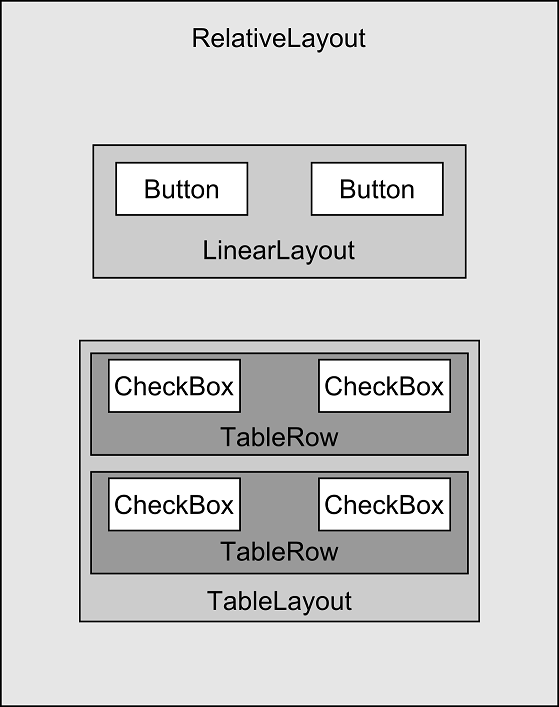
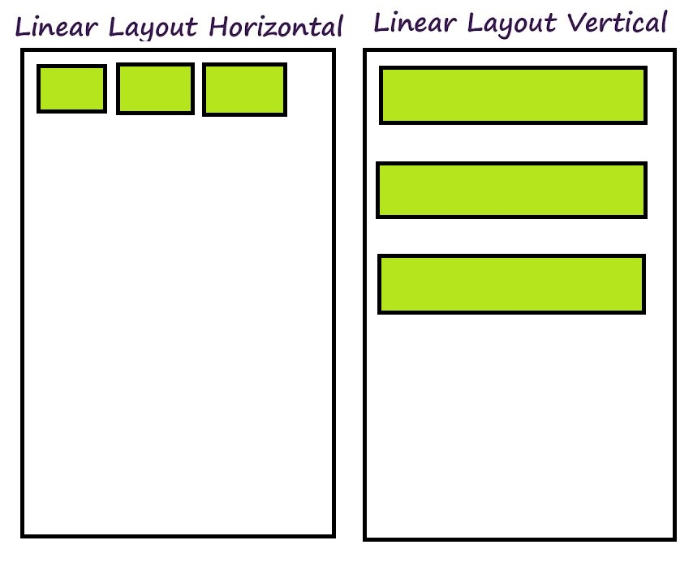
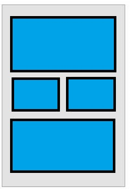
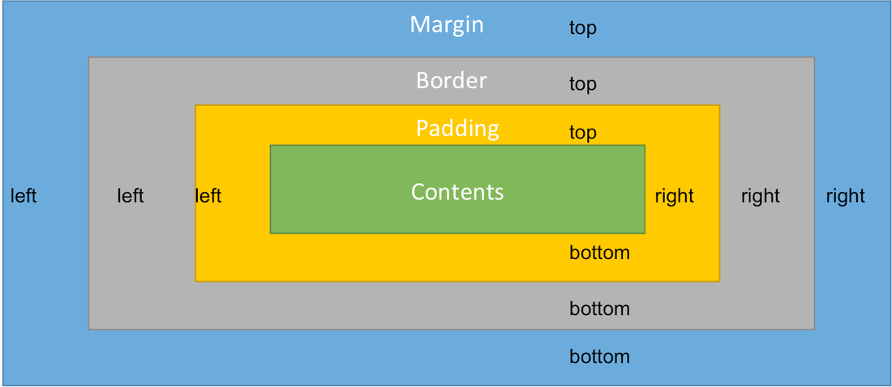
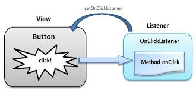
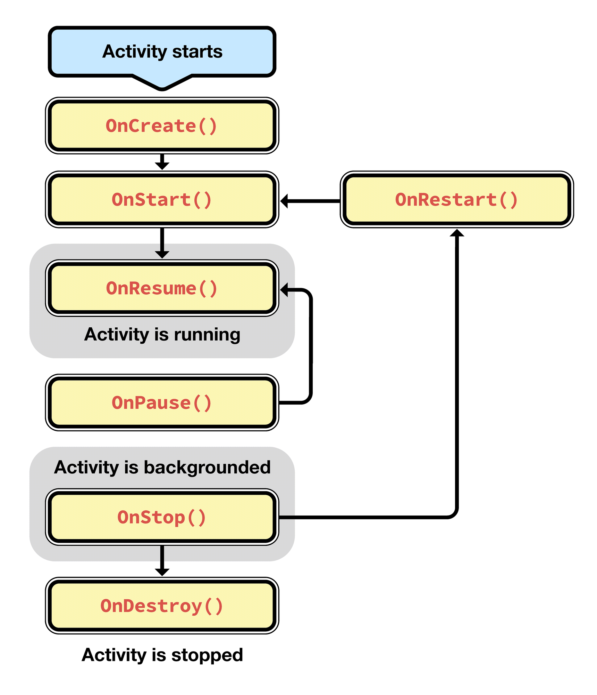

2주차

- Java 복습 및 과제 확인
    - Java Class, Interface, Static 배우기
    - Class
      - 틀만들기, 빵틀
      - 클래스 만들고, 변수 함수 만들어보기
      - 인스턴스의 개념
    - Interface
      - 클래스인데 비어 있는 클래스
    - Extends
      - Override
      - Overload
      - 다형성
    - Static
      - 미리 메모리에 불러서 사용하는 경우
    - Enum
    
- 레이아웃(UI) 개념 및 종류
  - 뷰에 대한 소개
    - 정의 : 화면을 나타내는 최소 단위, 아이콘 따위
  - 레이아웃의 종류 및 구성 요소
    - xml이란?
    - Linear layout
      - width, height, orientation
      - id
      - weight
    - 상대 레이아웃(Relative layout)
      - width, height, rightOf, endOf
      - padding, margin
    - Grid layout

    - Constraint layout
      - UI에디터 사용법


- 각종 버튼과 앱을 연결해보기
  - 버튼의 종류
    - width, height, click, id
    - margin, padding
    - sp, dp 차이
  - 이벤트란?
    - 리스너, 함수 사용

- 안드로이드 라이프 사이클

- 미니프로젝트
    - 안드로이드로 간단한 계산기 만들기

<!-- Include required permissions for Google Mobile Ads to run. -->
<uses-permission android:name="android.permission.INTERNET"/>
<uses-permission android:name="android.permission.ACCESS_NETWORK_STATE"/>

----

### Class란?

클래스는 자바에서 함수, 변수 등을 묶어서 쓰는 '틀'이라고 생각하면 됩니다.
함수가 반복되는 일을 줄이기 위해 나왔듯이,
클래스도 반복을 최소화하기 위해서 나왔어요.

예를 들어볼께요. 빵을 만드는 경우를 생각해보죠.
빵을 하나를 만드는 건 쉽지만 수백개를 손으로 만드려고 하면은 어렵죠.
이때 우리는 빵을 찍어낼 빵틀이 필요해요.

클래스가 하는 일이 빵틀과 같아요.
여러번 해야할 일이 있는데, 일일이 함수를 만들어 쓰려면 효율적이지 않으니
클래스를 만들어서 반복을 줄이는 거죠.


```java
class Bread {
  int size = 100;
  String taste = "달다";
}
```

그럼 클래스는 어떻게 사용해야할까요?
아까 빵틀이 클래스라고 했죠?
빵을 만들어서 사용을 합니다.

아래와 같은 모양으로 클래스를 만들어요.

```java
public class Main {
  public static void main(String[] args) {

  // 클래스 이름 = new 클래스();
  Bread bread1 = new Bread();
  Bread bread2 = new Bread();

  }
}
```
조금 낯설 수 있는데 곧 적응될 거에요.
클래스를 만들 때는 항상 **new** 를 적어줘야해요.

실제 사용할때는 **이름** 을 가지고 사용하는데요.
여기서 이름은 **bread1** 이 되겠네요. 이름의 정확한 명칭은 **인스턴스** 인데 나중에 더 설명을 할께요.

```java
bread1.size;
bread1.taste;
System.out.println(bread1.size);
```

출력을 해보면 Bread에 있던 size의 값이 나오죠?

클래스는 안에 있는 변수를 가져오거나 바꿀 수 있어요.

첨이라 복잡하지만 익숙해지면 따로 관리하니 편하단걸 알 수 있을 거에요.

클래스에는 변수만 넣을 수 있는 게 아니에요.

함수도 넣을 수 있답니다.

```java
class Bread {
  int size = 100;
  String taste = "달다";

  void showTaste() {
    System.out.println(taste);
  }
}
```

클래스에 있는 함수도 변수와 비슷한 방법으로 사용할 수 있습니다.

```java
public class Main {
  public static void main(String[] args) {
      Bread br = new Bread();
      br.showTaste();

      br.taste = "고소하다";
      br.showTaste();

      String name = "Mike";
      String address = new String("Seoul");
  }
}
```

클래스에서 함수를 쓰는 걸 보면 어딘가 익숙한데요.
문자열, String이랑 비슷하게 생기지 않았나요?
사실 String도 클래스의 일종입니다. 사람들이 편하게 썼던 문자열도 기본 자료형이 아니었던거죠.

여태까지는 클래스를 만들고 변수에 값을 넣어줬는데
만들때부터 값을 넣어줄 수는 없을까요?

```java
class Bread {
  int mSize = 100;
  String mTaste = "달다";

  void showTaste() {
    System.out.println(taste);
  }

  Bread(int size, String taste) {
    this.mSize = size;
    this.mTaste = taste;
  }
}
```
가능합니다. 클래스에다가 Constructor(생성자)라는 걸 추가해주면 되는데요.
생성자라는 번역이 좀 어색해서 잘 안 와닿을거에요. 컨스트럭트(Construct)가 만든다는 뜻이잖아요.
컨스트럭터(Contructor)는 만들어주는 일을 하는 것이라고 보면 되요.

컨스트럭터는 클래스를 처음 만들때, 값을 넣고 싶은 경우에 사용합니다.

```java
public class Main {
  public static void main(String[] args) {
      Bread myBread = new Bread(500, "부드럽다");
      System.out.println(myBread.mSize);
  }
}
```

### Extend - 상속

클래스는 중복을 줄이기 위해 만들어졌어요.

중복을 줄이려면 만들어진 걸 재활용해야해요.

다시 쓰기 위해 나온 게 상속이란 개념인데요.

다른 클래스를 **확장** 해서 쓴다고 보면 되요.


```java
자식클래스 extends 부모클래스
```

기본 구조는 계속 쓰려는, 원형이 되는 클래스를 가져다가 쓰는 거라고 보면 되요.

```java
public class Person {
    String name;
    int weight;
    int height;
}
```

```java
public class Man extends Person{
    boolean isBold = false;
}
```

```java
public class Woman extends Person {

}
```

상속을 하게 되면 부모(상위의 클래스)에 있는 변수나 클래스를
모두 쓸 수 있어요.


### Interface - 인터페이스

인터페이스는 상속이랑 비슷하게 생겼는데 좀 달라요.

우리가 해야할 일을 알려주는 역할을 한다고 봐야해요.

예컨데, 여행준비를 한다고 생각을 해볼께요.
여행 가려고 하면 꼭 해야하는 일들이 있죠.
어떻게 이동할지 정하기(버스,기차,비행기), 어디 머물지 정하기, 입을 옷 챙기기 등 할 일이 많아요.
하지만 바빠다 보면 깜빡하기가 쉽습니다.

누가 안 까먹게 신경 써줬으면 좋겠죠?
그게 인터페이스가 하는 역할입니다.


#### Enum
자바에서 Enum(이넘)은 여러 변수를 함께 묶어야할 때 쓰입니다.

근데 꼭 Enum은 필요한 걸까요? 그냥 변수를 쓰면 안 될까요?

요일을 나타내는 변수를 이때까지 배운걸로 만들어볼께요.

```java
public int MONDAY = 100;
public int TUESDAY = 200;
public int WEDNESDAY = 300;
public int THURSDAY = 400;
public int FRIDAY = 500;
public int SATURDAY = 600;
public int SUNDAY = 700;
```

변수를 7개나 적어야해서 보기 좋지 않고
한눈에 들어오지 않습니다.

반면 Enum을 보죠.

```java
enum DAY {
  MON,TUE,WED,THU,FRI,SAT,SUN
}
```

한 블록 안에 다 들어와 있어서 보기가 편하고 구분도 잘 됩니다.

Enum은 클래스랑 비슷하게 사용합니다.

```java
DAY today = DAY.MON;
```

### Layout

레이아웃은 XML로 만들어져 있어요. XML은 처음에는 헷갈리는데 금방 익숙해질 거에요.
간단히 XML의 개념만 이야기하고 넘어갈께요.


##### xml(엑스엠엘) 설명
xml은 데이터를 저장하고, 보여주는 데 사용하는 문서입니다.
엑셀이나 워드를 보면 일정한 형식이 있는데
xml도 컴퓨터가 이해하기 쉽게 만든 문서에요.

xml은 웹의 기본인 html이랑 무척 비슷하게 생겼어요.


```xml
<coffeeshop>

  <americano>
    <ice>5</ice>  
    <coffee>150</coffee>
  </americano>

  <cafelatte>
    <ice>8</ice>
    <milk>50</milk>
    <coffee>130</coffee>
  </cafelatte>

</coffeeshop>  
```

```xml
xmlns는 namespace를 일컫는다.

namespace는 동일한 이름의 요소들이 충돌하는 걸 막기 위해 쓰인다.

똑같은 body여도 다르게 쓰일 수 있다.

첫번째 body는 html이지만
<body>
  <h3>html의 글자</h3>
  <p>html의 단락</p>
</body>

두번째 body는 신체 정보를 의미한다.
<body>  
  <weight>70</weight>
  <height>175</height>
</body>  

xml에서는 이런 충돌을 막기 위해 네임스페이스(xmlns)를 쓴다.

xmlns는 <요소이름 xmlns:prefix="URI"> 방식으로 쓰인다.
예컨데  <html:body xmlns:html="https://www.w3.org/TR/html5/"> 같은 식으로 쓰인다.
URI는 Uniform Resource Identifieres의 약자인데, 인터넷 상의 자원을 나타낼 때 쓰인다.
인터넷 주소도 URI의 하나이다.  

<root
  xmlns:html="https://www.w3.org/TR/html5/"
  xmlns:physical="http://codingsam.com/xml/physical/">

  <html:body>
    <html:h3>html의 글자</html:h3>
    <html:p>html의 단락</html:p>
  </html:body>

  <physical:body>  
    <physical:weight>70</physical:weight>
    <physical:height>175</physical:height>
  </physical:body>

</root>

```

안드로이드 xml도 동일한 구조를 가지고 있어요.
처음에 xmlns를 선언하고 그 밑에 요소(attribute)들을 놓는 구조에요.

```xml
<RelativeLayout xmlns:android="http://schemas.android.com/apk/res/android"
    xmlns:app="http://schemas.android.com/apk/res-auto"
    xmlns:tools="http://schemas.android.com/tools"
    android:layout_width="match_parent"
    android:layout_height="match_parent"
    tools:context="com.hello.MainActivity">

</RelativeLayout>
```


### 레이아웃 구조


안드로이드는 한 화면을 레이아웃이라는 걸로 표시해요.
레이아웃 안에 각종 뷰(버튼,텍스트,프로그레스바 등)이 있는 구조입니다.

레이아웃은 어떻게 UI를 만들지 정하는 뼈대라고 보면 되요.

레이아웃을 어떤 걸 정하느냐에 따라
안에 들은 뷰들은 큰 영향을 받아요.

안드로이드 레이아웃 종류는 정말 많은데요.
많이 쓰는 몇개만 알아볼께요.

#### Linear Layout

리니어 레이아웃은 수직이나 수평으로 뷰를 배치하는 레이아웃입니다.

일단 한번 뷰들을 레이아웃 위에 놓아볼께요.

수직이나 수평으로만 계속 뷰가 놓이는 걸 알 수 있죠?

orientation을 통해 방향을 정해줍니다!

리니어 레이아웃의 가장 큰 특징은 weight 인데요.

리니어 레이아웃 안에 있는 뷰들의 비중을 정할 수 있어요.

3개의 버튼을 놓고 1:2:1로 weight를 맞춰볼까요?

화면 전체 해상도와 상관없이 버튼의 비중이 정해지게 됩니다.

다른 해상도를 지닌 기기로 바꿔도 그대로죠.

이때문에 리니어 레이아웃이 많이 쓰였습니다.

만들기 쉽고 편하거든요. 대신 속도 문제가 좀 있어요.

뷰의 위치를 정확하게 하는데도 좀 어려움이 있구요.


##### Linear Layout의 구성요소(attribute)
레이아웃은 항상 넓이(width)와 높이(height)를 정해줘야해요

```xml
android:layout_width="match_parent"
android:layout_height="match_parent"
```

layout_width안에 값을 바꿔주면 넓이가 변하게 됩니다.
layout_width에 넣을 수 있는 값은 3개가 있어요.

- match_parent
  : 바깥 부분에 맞게 꽉 채우기
- wrap_content
  : 내용물에 맞게 크기 조절하기
- xxdp (100dp, 150dp)
  : 해상도에 따른 값으로 조절하기


3개 중에 원하는 대로 골라서 쓰면은 되고,
가장 밑에 있는 레이아웃의 경우 보통 match_parent를 써요.  

```xml
android:layout_width="100dp"
android:layout_height="wrap_content"
```


#### Relative Layout


다음으로 많이 쓰는 건 렐러티브 레이아웃인데요.

안에 있는 뷰들의 위치에 따라서

뷰의 위치가 바뀝니다.

마치 똑같은 사람이어도 누구한테는 '엄마' 누구한테는 '이모'이고 누구한테는 '고모'인것처럼

뷰도 위치에 따라 서로의 관계를 나타내게 됩니다.

**'버튼1의 오른쪽(rightOf)', '텍스트뷰1의 왼쪽', '레이아웃의 끝에(endOf)'** 등 종류가 무궁무진해요.

이건 해봐서 익숙해지는 게 답이랍니다 ㅠㅠ

렐러티브 레이아웃이 세밀하게 위치를 잡기에 더 좋고

속도도 리니어 레이아웃보다 나은 편입니다.

하지만 렐러티브 레이아웃도 이제는 물러나는 추세에요.

구글에서는 ** Constraint Layout ** 을 권장하고 있습니다.


#### TextView

뷰는 id를 통해 다룰 수 있는 게 가장 큰 특징이에요.

사실 텍스트뷰나 버튼이나 비슷한 특성을 공유해요.

또한 세밀한 위치 조정을 위해 padding과 margin을 자주 사용한답니다.

padding은 안쪽으로 들어오고,

margin은 바깥쪽으로부터 움직입니다.

한번 보여드리는 게 날 것 같네요.




#### Button
누를 수 있는 뷰에요. 상호작용을 위해서 사용한답니다.

#### EditText
문자 입력을 받을 수 있는 뷰에요.

로그인 화면 등을 만들 때 사용합니다.

#### ImageView
이미지를 표시하기 위해서 사용하는 뷰에요.

정말 많이 쓰입니다.

#### 뷰(View)와 액티비티(Activity)의 연결
레이아웃에 놓은 뷰를 어떻게 실제 코드와 연결을 할까요?

이 작업은 뷰에 있는 id를 통해 이뤄집니다.

```java
public class MainActivity extends AppCompatActivity {

    Button login;

    @Override
    protected void onCreate(Bundle savedInstanceState) {
        super.onCreate(savedInstanceState);
        setContentView(R.layout.activity_main);

        login = findViewById(R.id.login);
        login.setOnClickListener(event -> {

        });
    }
}
```

findViewById()가 보이나요?
이 함수를 통해 뷰의 ID를 찾은 뒤, 액티비티에서 사용할 수 있게 해줍니다.

버튼 객체를 생성하는 작업이라고 보면 되요.

```java
Button login = findViewById(R.id.login);
Button login2 = new Button();
```

실제 findViewId를 써서 찾은 뷰는
인스턴스처럼 쓸 수 있어요.

이제 뷰에 입력을 받는 법을 알아볼께요.

#### 이벤트 관리하기
뷰들은 사람이 뷰를 누를 때 반응을 해요.
사람이 뷰를 건드리는 걸 뷰 입장에서는 이벤트라고 하는데,
뷰는 이벤트가 생기기만을 간절히 기다리고 있습니다.

이벤트는 **'화면 터치'나 '마우스 클릭'** 같은 걸

뷰는 이벤트를 처리하기 위해서 **'리스너(listener)'** 를 씁니다.

동작 과정을 하나하나 설명해볼께요.

1. 뷰(버튼)과 리스너를 연결한다.
2. 뷰는 이벤트가 들어오기를 기다리고(listen) 있다.
3. 이벤트가 들어오면(화면 터치 등) 리스너는 정해진 일을 한다.




#### 안드로이드 생명주기



안드로이드는 라이프사이클이란 독특한 개념이 있는데요.

언제 앱이 시작되고 멈출지 모르기 때문에 생긴 개념이랍니다.

우리가 노트북이나 데스크탑을 쓸 때는 주로 안 자리에서 사용하고

방해받을 일이 상대적으로 적죠.

반면 스마트폰의 경우 중간에 전화도 오고, 쓰다가 내려놓는 일도 잦은 편이죠.

안드로이드 생명주기는 이런 상황을 다루기 위해 나온 개념입니다.

**앱을 완전히 끄는 경우, 잠깐 밑으로 내린 경우, 다시 앱을 쓰는 경우** 등에 여러 상황이 있죠.

크게 3가지만 기억하면 됩니다.

1. onCreate - 앱(액티비티)을 처음 시작할때 호출됨
2. onResume - 앱(액티비티)에 들어갈 때 호출됨
3. onStop - 앱(액티비티)을 백버튼, 홈버튼 등을 눌러 안보이게 했을때 호출됨, 백그라운드 상태일때 호출되는거죠.


### 안드로이드 미니 프로젝트
- 로그인 화면 만들어 보기
- 계산기 만들어보기


참고 : Constraint Layout ( https://medium.com/@futureofdev/android-constraintlayout-%EC%89%BD%EA%B2%8C-%EC%95%8C%EC%95%84%EA%B0%80%EC%9E%90-62d2ded79c17 )
