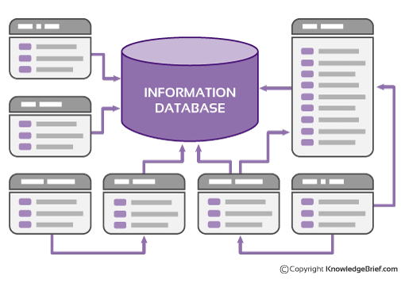
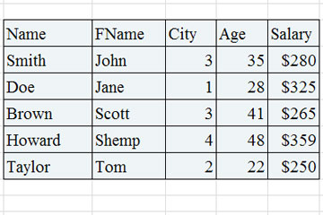

- 데이터베이스란?
- shared preference
  - 임시 데이터
- sql database
  - sql helper
- room


### 데이터베이스란?


많은 데이터를 다루는 거대한 소프트웨어이다.
우리가 문서를 쓰거나, 엑셀을 할때 작게 하나하나의 파일을 만들어서 그 안에 데이터를 저장한다.

파일이 1,2개일때는 문제 없지만 100개, 1000개를 다루고 싶을 때는 어떻게 해야할까? 파일을 고칠 때마다 모든 파일을 업데이트하거나 지워야할까?

파일이 서로 관련 없을 때는 1개의 파일만 쓰면 된다. 반면 여러 파일이 같이 관련 있을때는 어떻게 해야할까? 엑셀을 7,8개씩 띄워놓고 수정할 수도 없는 노릇이다.

이런 문제를 해결하기 위해서 나온 게 데이터베이스이다.

데이터베이스에는 다양한 종류가 있는데, 오라클(한때 세계 1,2위를 다투던 IT회사), mysql, mongodb, sqlite3 등등 무수히 많은 데이터베이스가 있다.

우리는 이 중에서 Sqlite3를 다뤄보도록 하겠다.

### SQLite 3

400kb 정도 밖에 안되는 가벼운 데이터베이스이다.

간단한 데이터를 일고 쓸 때 쓰인다.

자원이 한정적인 모바일용으로 적합하다.

#### 테이블
SQlite3는 테이블 형태로 데이터를 구분한다.

테이블에는 행과 열이 있고, 첫번째 열에는 어떤 데이터 종류인지 나타내는 값이 들어있다.



첫번째 행을 보면 name,fname,city,age,salary가 있는데 하나의 데이터를 나타낸다. 이처럼 행은 하나 데이터(여기서는 한사람의 데이터)를 나타낸다.

Name으로 된 열을 보면 모두 이름을 나타내는 것을 알 수 있다. 열은 같은 종류의 데이터를 나타낸다.

그림처럼 전체 데이터의 묶음을 테이블이라고 하며, 테이블 단위로 데이터를 관리(만들고,수정하고,지운다)한다.


##### SQLite Type
- NULL
  - 아무것도 없는 걸 적을때 쓴다.
- INTEGER
  - 정수값. 1,2,3,4,10 등 숫자를 적음
- REAL
  - 실수값. 1.34, 3.56 등 소수점 있는 숫자를 적음
- TEXT
  - 문자열, UTF-8, UTF-16로 인코딩된다.
- BLOB(Binary Large Object)
  - 대형 이진 객체. 작은 텍스트나 이미지, 비디오 등 다양한 형태를 저장한다.

##### SQLite 명령어들

테이블 만들기
```sql
create table employee(
id integer primary key autoincrement,
name text not null,
wage real not null,
age integer
);
```

테이블에 값 넣기 - 모든값
```sql
insert into employee(id,name,wage) values(1,"영수",200);
insert into employee(id,name,wage) values(2,"지선",250);
insert into employee values(3,"철수", 400);    
```

테이블에 값 넣기 - 일부만

```sql
insert into employee(name,wage,age) values("미선", 230, 23)
```

테이블에 있는 값 조회하기(query) - 전체
```sql
select * from employee;
```

테이블에 있는 값 조회하기 - 일부
```sql
select * from employee where id = 1;
select name from employee;
```

테이블에 있는 값 변경
```sql
update employee set age = 33 where id = 1;
```

테이블에 있는 값 지우기
```sql
delete from employee where id = 1;
```

테이블 삭제
```sql
drop table employee;
```

### 안드로이드와의 연동

### Query
INSERT, UPDATE, CREATE는 실행시 **execSQL()** 란 함수를 쓴다.

```java
SQLiteDatabase db;
String sql = "create table store (id integer primary key not null)";
db.execSQL()
```

반면 SELECT의 경우 **rawQuery()** 란 함수를 사용한다.

```java
public void showData() {
    String sql = "select * from " + tableName;
    Cursor cursor = db.rawQuery(sql, null);

    while (cursor.moveToNext()) {
      // 첫 번째 컬럼(Column)이 INTEGER 타입인 경우.
      int val = cursor.getInt(0) ;

      // 두 번째 컬럼(Column)의 타입이 TEXT 인 경우.
      String str = cursor.getString(1) ;

      // 세 번째 컬럼(Column)이 REAL 타입으로 선언된 경우.
      float real = cursor.getFloat(2) ;
    }
}
```   
