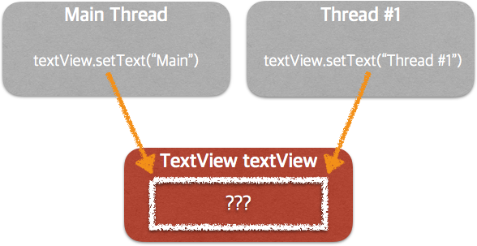
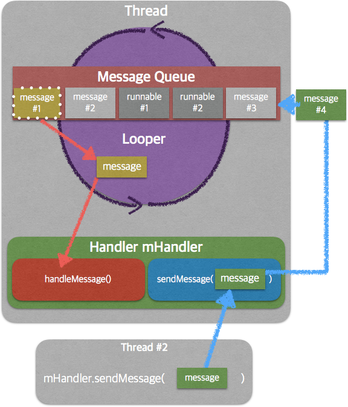

- 안드로이드 프로세스

- 안드로이드 스레드의 종류
  - 포그라운드
  - 백그라운드

- 스데드 간의 통신

- 안드로이드 서비스


##### 프로세스와 안드로이드에서의 프로세스

프로세스는 메모리를 상에서 실행되는 프로그램(앱)을 말한다. 모든 프로그램은 프로세스 단위로 동작하며, 프로세스는 프로그램을 하나 실행할 때마다 만들어진다. 프로세스 별로 고유한 ID가 있고, 운영체제는 ID로 프로세스를 구분한다. 메모장을 여러번 실행하면 메모장이 담긴 여러 프로세스가 메모리에 있게 된다. 각기 다른 ID를 지닌 메모장이 여러개 열리는 것이다.

안드로이드의 프로세스도 일반 프로세스와 기본적으로 같지만, 모바일의 다양한 상황에 대응하기 위한 조건들이 추가되어 있다.

안드로이드의 경우 기본적으로 앱과 프로세스는 1대1 관계지만 필요하다면 앱을 여러 프로세스에서 동시에 실행할 수도 있고, 반대로 하나의 프로세스에서 여러 앱이 실행될 수도 있다.

안드로이드 프로세스의 구조는 3단계로 이뤄져있다.

가장 바깥에 리눅스 프로세스가 있고, 안쪽에 JVM, 앱 순서로 되어있다.

**리눅스 프로세스 > JVM > 앱**


##### 안드로이드 프로세스 조회
adb shell에서 실행중인 프로세스를 조회해 볼 수 있다.

```shell
adb shell ps
```
무수히 많은 프로세스가 출력된다.
어떤 형식으로 적혀 있는지 보도록 하자.

|USER|PID|PPID|VSZ|RSS|WCHAN|ADDR|S|NAME|
|---|---|---|---|---|
|u0_a7|23162|1564|1388972|54140|SyS_epoll_wait|0|S|com.android.defcontainer|

UID : 안드로이드 프로그램별 ID, 프로그램이 설치되면 할당되는 ID 이다.

PID : 부모 프로세스의 ID, 안드로이드는 언제나 Zygote

PPID : 프로세스 ID

VSZ : 프로세스의 가상 메모리 크기 (virtual memory size of process in KiB(1024 bytes unit))

RSS : 실제 물리적으로 할당된 메모리양 (resident set size, the non-swapped physical memory that a task has used.)

PID는 여러 프로세스가 동일한 값을 사용하고 있다.

##### 앱 시작과 Zygote 프로세스
안드로이드의 리눅스 프로세스 처음 만들어질때 다음과 같은 과정을 따른다.

1. 리눅스 프로세스를 시작한다.
2. 런타임을 만든다.
3. Application의 인스턴스를 만든다.
4. 응용 프로그램의 시작점을 만든다.

매번 프로세스를 새로 시작하고, 런타임을 설정하는 건 오래 걸린다. Zygote는 이 작업을 줄이기 위해 만들어졌다. Zygote 프로세스는 특별한 종류의 프로세스이다. Zygote는 모든 앱에서 공유되는 핵심 라이브러리를 담았다.프로세스는 실행될 때 필수 라이브러리를 복사하지 않고, Zygote프로세스를 포크(Fork)한다.

##### 프로세스 우선 순위
우선 순위가 낮은 앱들은 메모리가 부족할 때 OS 상에서 먼저 종료된다.

우선 순위가 높은 앱부터 보자.

1. 포그라운드
  - 전면에 보이는 프로세스
2. 화면에 보이는 프로세스
  - 다 보이지는 않지만 화면에 드러나 있는 프로세스
3. 서비스
  - 백그라운드 실행 중이고, 화면의 구성요소와 연결 되어 있지 않은 프로세스
4. 백그라운드
  - 화면에 보이지 않는 액티비티, 대부분의 앱들이 가지는 레벨
5. 빈 프로세스
  - 활성화된 구성요소가 없는 프로세스. 다시 실행될 때는 대비해 유지하고 있지만, 시스템의 자원을 회수할때 가장 먼저 회수함.


##### 프로세스와 스레드의 차이
프로세스는 각각 주소 공간(address memory)가 있는 반면 스레드는 공유 메모리(a shared memory space)가 있다. 스레드는 공유 메모리를 통해서 데이터를 같이 쓰거나 읽을 수 있다.


안드로이드는 빠른 UI 반응을 위해 항상 스레드를 사용하고 있습니다. 하나의 스레드만 쓰면 데이터베이스를 쓰거나 네트워크를 쓸때, 사용자의 입력을 받을 수 없기 때문이지요. 이전까지는 하나의 스레드만 사용하고 있엇죠. 스레드가 어떻게 쓰이는지를 알아야 깔끔하고, 만족도 높은 앱을 만들 수 있어요.


#### 자바 스레드를 그대로 사용할 수 있을까?

버튼이 눌리면 텍스트뷰를 스레드를 통해 업데이트 하는 코드를 작성해볼께요.

```java
TextView title;
Button setup;

@Override
protected void onCreate(Bundle savedInstanceState) {
    super.onCreate(savedInstanceState);
    setContentView(R.layout.activity_timer);

    title = findViewById(R.id.title);
    setup = findViewById(R.id.setup);

    setup.setOnClickListener(event -> {

        Thread thread = new Thread() {
            @Override
            public void run() {
                title.setText("제목");
            }
        };

        thread.start();

    });
```

제대로 동작하지 않죠? 앱이 멈춥니다.
안드로이드는 모든 UI 수정은 메인 스레드(UI스레드)에서만 하도록 되어 있는데, 새로운 스레드를 만들어서 수정하려고 하니 에러가 난 것입니다.

UI스레드에서 돌아가도록 스레드를 만들어볼께요.

```java
setup.setOnClickListener(event -> {
    runOnUiThread(new Runnable() {
        @Override
        public void run() {
            title.setText("제목");
        }
    });
})
```


#### 안드로이드 스레드 통신
UI를 수정하는 건 메인 스레드(UI 스레드)에서만 가능합니다.

여러곳에서 동시에 뷰를 수정하는 문제를 막기 위해서입니다!

사용자가 앱을 켰는데, 화면이 갑자기 1초 간격으로 바뀐다거나, 앱을 켜는 순서에 따라 내용이 달라진다면 얼마나 당황스러울까요? 이를 막기 위해서 생겨난 원칙입니다.




스레드는 기본적으로 메시지를 통해 통신을 합니다.

스레드 통신에는 크게 3개가 필요한데
핸들러, 루퍼, 메시지 큐입니다..

각각의 역할을 짧게 설명해 볼께요.
결론부터 말하면 다 메시지를 전달하는 용도에요.

핸들러 : 루퍼와 스레드의 연결 통로


루퍼 : 메시지 큐에 있는 메시지를 꺼내서, 핸들러에게 메시지를 처리하게 합니다.

메시지 큐 : 메시지를 쌓아놓았다가 언제 처리될지를 판단해서 루퍼로 보내서 처리하도록 한다.





#### 핸들러(Handler)
안드로이드 스레드는 그 안에서만 연산이 가능하지 다른 스레드와는 통신이 안됩니다. 하지만 스레드는 서로 데이터를 주고 받지 못하면 존재 의의가 없겠죠? 스레드 간의 통신을 위해 쓰이는 게 바로 '핸들러'입니다.

핸들러는 메시지를 보내고, 받는 역할을 합니다.

핸들러를 통해서 UI를 주기적으로 바꿔보도록 할께요.

핸들러를 쓰려면 3가지 작업을 해줘야해요.

1. 핸들러 만들기
2. 핸들러 내부에서 handleMessage 처리해주기
3. 메시지 정의해서 보내기

하나씩 해볼께요.

```java
uiHandler = new Handler() {
    @Override
    public void handleMessage(Message msg) { // 받은 메시지를 처리함.
        if (msg.what == 1) {
            timer.setText("" + seconds++);

            if (!stopTimer) {
                Message otherMsg = Message.obtain(); // 메시지를 얻음.
                otherMsg.what = 1; // 어떤 메시지를 보낼지 정의함.
                uiHandler.sendMessageDelayed(otherMsg, 1000);
            }
        }
    }
};
```

```java
Message msg = uiHandler.obtainMessage(); // 메시지를 얻음
msg.what = 1; // 어떤 메시지를 보낼지 정의
uiHandler.sendMessage(msg); // 메시지를 루퍼로 보냄.
```

- sendMessage() - 스레드에서 오는 메시지를 루퍼로 보낸다.
- handleMessage() - 루퍼에서 온 메시지를 스레드로 전달한다.


#### Looper
루퍼는 메시지 큐에서 메시지를 가져와 핸들러에 전달하는 역할을 합니다.

일종의 메신저 같은 역할이지요.

메시지큐 <-> 루퍼 <-> 핸들러

루퍼는 무한히 루프를 돌며 메시지를 주고 받는 역할을 합니다.

루퍼가 없으면 메시지를 주고 받을 수 없죠.

메인스레드는 기본적으로 루퍼를 갖고 있지만, 보통의 스레드는 run만 실행하고 바로 종료를 하기에 루퍼가 없습니다.

그럼 보통의 스레드나 핸들러는 어떻게 메시지를 주고 받을까요?
스레드 내에서 루퍼를 쓰겠다는 말을 해줘야해요.

밑의 코드를 보면 run 안에 Looper.prepare()이 있죠? 이 스레드를 루퍼랑 연결하겠다는 뜻이에요.
이제 루퍼를 통해 메시지큐와 핸들러가 메시지를 주고 받을 수 있습니다.

그럼 위에서는 스레드 실행할때 Looper.prepare()가 없었는데 어떻게 된거죠?
메인스레드에서 실행을 하니 굳이 루퍼랑 연결할 필요가 없었던 거에요.

```java
Thread thread = new Thread() {
    @Override
    public void run() {
        Looper.prepare();
        dataHandler = new Handler();
        Looper.loop();
    }
};

thread.start();
```

##### Handler Thread
핸들러를 쓸때 매번 루퍼랑 연결 시키는 건 번거롭죠.

루퍼를 등독하는 작업이 미리 되어 있는 스레드가 핸들러 스레드랍니다.


## AsyncTask

##### AsyncTask 정의

안드로이드는 Thread, Handler 외에도 AsyncTask를 백그라운드 스레드로 많이 사용합니다.

AsyncTask는 4가지 단계로 구분이 됩니다.

1. 실행전 - onPreExecute()
2. 실행중 - doInBackground()
3. 실행중 UI 업데이트 - onProgressUpdate()
4. 실행후 - onPostExecute()

AsyncTask의 실행 전과정과 관련되어 있단 걸 알 수 있죠.

AsyncTask는 짧은 작업을 위한 용도입니다.

오래 걸리지 않는 작업을 용도로는 정말 유용하지만, 오래 걸리는 작업에 잘못 사용하면 메모리 누수의 위험이 있습니다.
따라서 반드시 액티비티 종료 전에 cancel()을 해줘야합니다.

특히 **doInBackground()** 메소드가 실행이 끝날때까지, 액티비티가 종료되더라도 계속 실행되게 됩니다.

**doInBackground()**에서의 작업이 끝난 후 캔슬된 적이 있으면 **onCancelled()** 가 호출되고, 없으면 **onPostExecute()**가 호출됩니다. 메모리 누수 방지를 여기서 해주도록 합시다.

그럼 코드를 보도록 할까요?

```java
class DownloadAsync extends AsyncTask<Integer, Integer, Integer> {
      @Override
      protected Integer doInBackground(Integer... integers) {
          Log.i("Async", "do in background");
          publishProgress(50); // UI 업데이트를 함. OnProgressUpdate로 50이 넘어감.
          return integers[0];
      }

      @Override
      protected void onProgressUpdate(Integer... values) {
          super.onProgressUpdate(values);
          Log.i("Async", "update " + values[0]); // publishProgress를 통해서 넘어온 값.
      }
}
```

```AsyncTask<>```를 보면 내부에 자료형이 적혀있죠?
어떤 콜백 메소드(doInBackground)가 어떤 자료형인지 정해주기 위한 것이에요.

```AsyncTask<String, Integer, Long>```  
<>안의 의미는 순서대로 doInBackground, onProgressUpdate, onPostExecute에 쓰이는 변수종류들 입니다.

AsyncTask 동작 과정을 다시 한번 볼께요.

1. AsyncTask 실행
2. onPreExecute() 실행 (생략가능)
3. doInBackground() 실행, execute할때의 값이 전달됨
4. doInBackground()에서 publishProgress 실행.
5. 4번의 값이 onProgressUpdate()로 전달됨.
6. 필요하면 UI업데이트를 onProgressUpdate에서 진행
7. onPostExecute() 실행

요약하자면 중요 작업은 doInBackground에서,
UI 작업은 onProgressUpdate에서 합니다!


###### AsyncTask 실행

AsyncTask는 실행하려면 인스턴스를 만들고, 꼭 execute를 해줘야해요.
execute할때는 AsyncTask<**Integer**, Integer, Integer> 의 첫번째 자료형에 맞는 데이터를 넣어주면은 되요!

```java
DownloadAsync async = async = new DownloadAsync();
async.execute(20, 30, 40);
```

AsyncTask가 실행이 되는건 로그를 통해 확인할 수 있습니다.

###### AsyncTask를 통해 프로그레스바 업데이트하기

보통 AsyncTask는 간단한 UI업데이트에 많이 쓰이는데요.
대표적인게 프로그레스바 업데이트에요. 파일을 다운로드하면 얼마나 받았는지 알려주는 UI가 뜨죠? 그게 프로그레스바에요!

일단 UI 코드를 먼저 적어볼께요.


```java
public class AsyncActivity extends AppCompatActivity {
    TextView home;
    ProgressBar progressBar;
    DownloadAsync async;
    Button click;


    @Override
    protected void onCreate(Bundle savedInstanceState) {
        super.onCreate(savedInstanceState);
        setContentView(R.layout.activity_async);

        home = findViewById(R.id.home);
        progressBar = findViewById(R.id.progress);
        click = findViewById(R.id.click);
    }
}
```

다음으로 AsyncTask의 기본 형태를 만들어볼께요.

```java
class DownloadAsync extends AsyncTask<Integer, Integer, Integer> { // <>안의 의미, 순서대로 doInBackground, onProgressUpdate, onPostExecute에 쓰이는 변수종류들이다.

    @Override
    protected void onPreExecute() {
        super.onPreExecute();
        Log.i("Async", "on pre execute");
    }

    @Override
    protected Integer doInBackground(Integer... integers) {
        publishProgress(i);
        Log.i("Async", "do in background");

        return integers[0];
    }

    @Override
    protected void onProgressUpdate(Integer... values) {
        super.onProgressUpdate(values);
    }

    @Override
    protected void onPostExecute(Integer integer) {
        super.onPostExecute(integer);
    }
}
```

AsyncTask의 기본 형태를 만들었으면 내부를 채워줍시다.

```java
@Override
protected Integer doInBackground(Integer... integers) {

    for(int i = 0; i < 100; i++) {
        try {
            publishProgress(i);
            Thread.sleep(30);
        } catch (InterruptedException e) {
            e.printStackTrace();
        }
    }

    Log.i("Async", "do in background");

    return integers[0];
}

@Override
protected void onProgressUpdate(Integer... values) {
    super.onProgressUpdate(values);
    progressBar.setProgress(values[0]);
}
```

이제 실행을 하면 progressBar가 업데이트 됩니다!

AsyncTask는 액티비티를 종료할때 꼭 cancel을 해줘야 메모리 누수의 위험이 없어요.
onStop()에다 cancel 코드를 넣어주도록 합시다!

```java
@Override
protected void onStop() {
    super.onStop();
    if(!async.isCancelled()) {
        async.cancel(true);
    }
}
```

아래는 전체 완성된 코드에요! 실행 안되는 게 있음 전체 코드를 보고 참고해주세요~

```java
public class AsyncActivity extends AppCompatActivity {
    TextView home;
    ProgressBar progressBar;
    DownloadAsync async;
    Button click;


    @Override
    protected void onCreate(Bundle savedInstanceState) {
        super.onCreate(savedInstanceState);
        setContentView(R.layout.activity_async);

        home = findViewById(R.id.home);
        progressBar = findViewById(R.id.progress);
        click = findViewById(R.id.click);

        click.setOnClickListener(event -> {
            async = new DownloadAsync();
            async.execute(20, 30, 40);
            click.setEnabled(false);
        });

    }

    @Override
    protected void onStop() {
        super.onStop();
        if(!async.isCancelled()) {
            async.cancel(true);
        }
    }

    class DownloadAsync extends AsyncTask<Integer, Integer, Integer> { // <>안의 의미, 순서대로 doInBackground, onProgressUpdate, onPostExecute에 쓰이는 변수종류들이다.

        @Override
        protected void onPreExecute() {
            super.onPreExecute();
            Log.i("Async", "on pre execute");
        }

        @Override
        protected Integer doInBackground(Integer... integers) {

            for(int i = 0; i < 100; i++) {
                try {
                    publishProgress(i);
                    Thread.sleep(30);
                } catch (InterruptedException e) {
                    e.printStackTrace();
                }
            }

            Log.i("Async", "do in background");

            return integers[0];
        }

        @Override
        protected void onProgressUpdate(Integer... values) {
            super.onProgressUpdate(values);
            progressBar.setProgress(values[0]);
        }

        @Override
        protected void onPostExecute(Integer integer) {
            super.onPostExecute(integer);
            Log.i("Async", "on post execute");
            Toast.makeText(AsyncActivity.this, "작업완료", Toast.LENGTH_SHORT).show();
            click.setEnabled(true);
        }
    }
}

```


참고 - https://academy.realm.io/kr/posts/android-thread-looper-handler/
