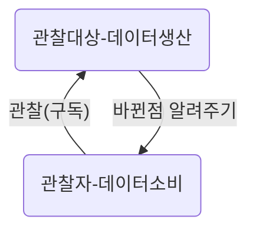
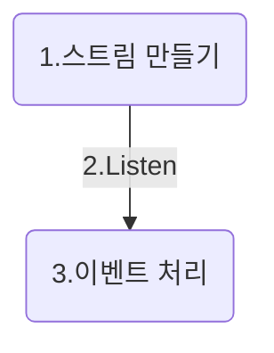

### 목차
- 1. 스트림이란?

  - 스트림 간단한 예제
  - 스트림 다양하게 처리하기

- 2. 스트림 내부 구조

  - 서브스크립션
  - 브로드 캐스트

- 3. 스트림 컨트롤러


### 1. Stream이란?

스트림은 데이터나 이벤트가 들어오는 통로다. 앱을 만들다보면 데이터를 처리할 일이 많은데, 어느 타이밍에 데이터가 들어올지 확실히 알기 어렵다. 스트림은 이와 같은 비동기 작업을 할 때 주로 쓰인다.

예컨데 네트워크에서 데이터를 받아서 UI에 보여주는 상황을 생각해보자. 언제 네트워크에서 데이터를 다 받을지 알기 어렵다. 신호가 약한 와이파이를 쓸 수도 있고, 빵빵한 통신을 쓰고 있을 수도 있다.  

이런 문제를 스트림은 데이터를 만드는 곳과 소비하는 곳을 따로둬서 이 문제를 해결한다.



스트림에서 데이터의 추가나 변경이 일어나면 이를 관찰하던데서 처리한다.

일단 이해를 돕기 위해 스트림을 하나 만들어보자.

1초마다 데이터를 만드는 스트림이다.

```dart
void main() {
  var stream = Stream.periodic(Duration(seconds: 1), (x) => x).take(10); // 1. 스트림 만들기 - 1초마다 데이터를 1개씩 만듬, 10개 까지만.
  stream.listen(print); // 2. 이벤트 처리
}
```
10초동안 1초 간격으로 출력을 한다.

짧은 코드지만 스트림을 이해하기에 충분하다.

좀 더  설명을 해보겠다.

- 1. *Stream.periodic()* 에서 일정시간마다 데이터(이벤트)를 만든다.

- 2. listen()을 한다. 스트림에서 만들어지는 이벤트를 관찰하기 시작한다.

  3. 리슨에서 적은대로 데이터를 다룬다. 여기서는 *listen(print)* 라고 적었기에 출력만 한다.

     다르게도 한번 바꿔보자. *listen((int number) => print(number + number))* 라고 적으면 어떤 결과가 나올까?


방금 전 코드를 그림으로 그리면 아래와 같다.



**스트림은 항상 만들기 -> 연결(listen) -> 데이터 처리의 과정을 거친다**. 하나라도 빠지면 안된다!


#### 1.1. Stream  - 여러 방법으로 스트림 만들기

스트림을 만드는 방법은 다양하다.

즉시 만들거나, 일정 시간마다 만들거나, 퓨처를 써서 만들 수 있다.

아래 예제를 보고 따라해보도록 하자.

```dart
void main() {
  Stream.fromIterable([1,2,3,4,5]) // 일반적인 데이터를 다룰 때
      .listen((int x) => print('iterable : ${x}'));

  Stream.periodic(Duration(seconds: 1), (x) => x) // 1초에 1번씩 동작
      .take(5) // 5개까지만 데이터를 처리함.
      .listen((x) => print('take : ${x}'));

  Stream.fromFuture(getData()) // 비동기 데이터를 처리할 때
    .listen((x) => print('from Future : ${x}'));
}

Future<String> getData() async {
  await Future.delayed(Duration(seconds: 5)); // 5초간 대기
  print("Fetched Data");
  return "5초 기다렸다가 온 데이터입니다";
}
```

```shell
// 출력결과
iterable : 1
iterable : 2
iterable : 3
iterable : 4
iterable : 5
take : 0
take : 1
take : 2
take : 3
take : 4
Fetched Data
from Future : 5초 기다렸다가 온 데이터입니다
```

이해가 되었는가? 반복적인 작업을 하고 싶다면  Stream.periodic()을 쓰고,

비동기 처리를 한다면 Stream.fromFuture()를 쓰도록 하자.


####1.2. Stream - 처음, 끝의 데이터만 사용하기

스트림 데이터를 다루는 방법은 다양하다.

맨 앞의 데이터만 쓸 수도 있고,  맨 마지막의 데이터만 쓸 수도 있다.

```dart
var stream = Stream.fromIterable([1,2,3,4,5]);
stream.first.then((value) => print("stream.first: $value"));  // 가장 앞의 데이터만 가져온다 - 결과 : 1

stream = Stream.fromIterable([1,2,3,4,5]);
stream.last.then((value) => print("stream.last: $value"));  // 가장 마지막의 데이터만 가져옴 - 결과값 : 5

stream = Stream.fromIterable([1,2,3,4,5]);
stream.isEmpty.then((value) => print("stream.isEmpty: $value"));  // 비어 있는지 확인 - false

stream = Stream.fromIterable([10,20,30,40,50,60]);
stream.length.then((value) => print("stream.length: $value"));  // 전체 길이 - 6
```

위의 예제를 잘 보면 스트림을 쓸때마다 계속 새로 만들어준다.

여기서 드는 의문.

_**stream.first 를 실행하고 stream.last 를 바로 실행할 수는 없는걸까? **_

아쉽게도 안 된다. 스트림는 기본적으로 싱글 서브스크립션(Single Subscription)이다. 싱글 서브스크립션은 한군데서만 리슨할 수 있다. 여러군데서 리슨하려면 브로드캐스트(Broadcast)로 변경해줘야하는데 밑에서 알아보도록 하자.


#### 1.3. Stream - 스트림 변경, StreamTransformer

map을 쓰면 스트림을 어느정도는 변경할 수는 있다.

```dart
  var streamMap = Stream.periodic(Duration(milliseconds: 200), (x) => x).take(3).map((x) => x + 10);
  streamMap.listen(print);
```

하지만 map만으로는 복잡한 처리를 하기 힘들다.

StreamTransformer를 쓰면 스트림을 변경해 쓰기에 좋다.  

```dart
var transformer = new StreamTransformer.fromHandlers(handleData: (value, sink) {
   	sink.add("First: $value"); // Stream Sink는 스트림 이벤트를 받아들이는 곳이다.
    sink.add("Second: $value");
});

var stream = Stream.fromIterable(["Good",1,2,3,4,5]);
stream.transform(transformer).listen((value) => print("listen : $value"));

```

map만 썼을 때보다 활용도가 높다.

####1.4 Stream - async*, yield

함수를 써서 스트림을 만드려면 어떻게 해야할까?

아래 코드를 보자.

``` dart
Stream<int> createStream(List<int> numbers) async* { // async*는 yield를 쓴다는 의미다.
  for (var number in numbers) {
    yield number; // yield는 제너레이터를 만든단 뜻이다.
  }
}

void main() {
  var numStream = createStream([1,3,5,7,9]); // 스트림을 만든다.
  numStream.listen((int number) => print(number)); // 스트림으로부터 데이터를 받아서 출력을 한다.
}
```
함수로 만든 스트림도 이전처럼 동작한다. 차이점은 async*와 yield를 써서 만들었단 점이다.

async*와 yield가 어떤 뜻인지 알아보자.

- async* : async*는 제너레이터를 만든단 뜻이다. 제너레이터는 게으르게(lazily) 데이터 연산을 할 때 쓰인다. 게으르다는 건 미리 연산을 다 하는 게 아니라, 요청이 있을때까지는 연산 하는 걸 미루어 두었다가 필요할 때 처리하는 걸 뜻한다.  

- yield : return이랑 유사하다. return은 한번 리턴하면 함수가 종료되지만, yield는 열린 채로 있어서 필요할 때 다른 연산을 할 수 있다.


async와 async*는 다르게 쓰이니 차이를 잘 알고 넘어가도록 하자.

이제 스트림에 좀 익숙해졌을 거다.

스트림을 더 써보기 전에 내부 동작을 알아보도록 하자.

### 2. Stream 내부 동작 원리
스트림은 3가지로 구성되어 있다.

- Stream
- StreamSubscription : 스트림과 이벤트의 연결고리, 이벤트에 변경이 생기면 처리한다
- 데이터(이벤트)

아래 그림을 보고 각각의 역할이 어떤지 알아보도록 하자.


[그림1]

```dart
var streamIter = Stream.fromIterable([10,20,30,40,50]);
StreamSubscription subscription = streamIter.listen((int number) => print(number));
subscription.cancel() // 연결 해제
```

그림에서도 볼 수 있듯이 스트림은 이벤트 소스와 연결되어 있다.

- listen 하기 전 : 강한 연결, 진한 화살표
- listen 한 후 : 약한 연결, 흐린 화살표, *StreamSubscription과 EventSource가 연결됨*

앞에선 listen()에서 이벤트 처리를 하는 것 같았지만, 실제로는 StreamSubscription에서 이벤트 콜백을 다룬다. 새로운 이벤트가 생기거나, 에러가 생기면, StreamSubscription에서 이를 처리한다. 뿐만 아니라 StreamSubscription은 이벤트 소스와의 연결도 끊어버릴 수 있다.

StreamSubscription은 이벤트 처리를 콜백을 정해서 한다.

2가지 방법이 있는데 아래 코드를 보자.

- onData, onError, onDone을 subscription에서 정의

```dart
  var stream = Stream.periodic(Duration(milliseconds: 200), (x) => x);
  StreamSubscription subscription = stream.listen(null);
  subscription.onData((value) { // onData : 데이터를 하나씩 처리할때
    print("listen stream : $value");
    if (value == 10) {
      subscription.cancel();
    }
  });

  subscription.onError((err) => print("error : $err")); // 에러가 났을때
  subscription.onDone(() => print("on done")); // 더 받을 데이터가 없을때
```

- listen 내부에 정의

```dart
var stream = Stream.periodic(Duration(milliseconds: 200), (x) => x).take(10);
var subscription = stream.listen((x) => print,
      onDone: () {
        print("on done");
	 },
      onError: () {
        print("on error")
});
```

사용법은 다르지만 동작은 동일하다.

취향에 맞게 사용하도록 하자.


#### Stream - BroadCast

기본적으로 만들어지는 스트림은 한 곳에서만 listen할 수 있다.

아래 코드를 실행해보면 에러가 난다.

```dart
var stream = Stream.periodic(Duration(milliseconds: 200), (x) => x)
                  .where((x) => x % 2 == 0)
                  .take(3);
stream.listen(print);
stream.listen(print);
```

여러 곳에서 listen을 하려면 브로드캐스트를 사용해야한다.

```dart


var sc = StreamController.broadcast(); //
var broadcastStream = sc.stream;
broadcastStream.listen((v) => print('broadcast1 ${v}'));
broadcastStream.listen((v) => print('broadcast2 ${v}'));
sc.add(10);
sc.add(20);
```

실행하고 출력을 확인해보자.

```shell
broadcast1 10
broadcast2 10
broadcast1 20
broadcast2 20
```

여러번 리슨할 경우 각각의 데이터를 따로 처리하는 걸 알 수 있다.

같은 데이터를 다른 뷰에서 처리할 때 효과적으로 쓸 수 있겠다.

요약하면 다음과 같다.

- single - listen을 한번만 할 수 있음, 기본 스트림 컨트롤러임.

- broadcast - listen을 여러번 할 수 있음.


[그림2]

### 3. StreamController

Stream을 매번 열었다가(listen) 닫는 건(cancel) 비효율적이다.

게다가 스트림이 여러 개일때는 모든 스트림을 일일이 닫는 건 비효율적이다. 여러 스트림을 관리하기 위해 StreamController를 쓴다.

아래의 예제를 보자.

```dart
final StreamController ctrl = StreamController();
final StreamSubscription subscription = ctrl.stream.listen((data) => print(data)); // 데이터가 더해질때마다 print 한다.

ctrl.add(10); // 데이터 추가
ctrl.add(200);
ctrl.add(300);

ctrl.close(); // 컨트롤러 닫음

//final StreamSubscription subscription2 = ctrl.stream.listen((data) => print(data)); // 에러발생! listen을 여러번 하는 건 안됨. 스트림을 브로드캐스트로 바꿔줘야함.

ctrl.add(950); // 위에서 컨트롤러가 닫혔기에 출력되지 않음.
```

스트림 컨트롤러에 데이터가 더해질때마다 값을 출력한다. 스트림 컨트롤러가 닫기 전까지만 이벤트를 처리한다.

아래 그림2을 보자. 위의 [그림1]과 유사한데, 스트림 컨트롤러만 추가되었다.

스트림 컨트롤러를 쓰면 여러 스트림을 한꺼번의 관리할 수 있기에, 앱을 제작할 때 도움이 된다.


[그림3]


### 마무리

스트림을 쓰면 비동기 상황에 대처하거나, 반응형 프로그램을 만들기에 좋다. 

스트림을 익혀서 좀 더 쾌적한 프로그램을 만들어보도록 하자.

다음에는 플러터에서 어떻게 스트림이 쓰이는지 알아보자. 

참고 - https://www.dartlang.org/articles/libraries/broadcast-streams (그림출처)

참고 - http://dartdoc.takyam.com/docs/tutorials/streams/
