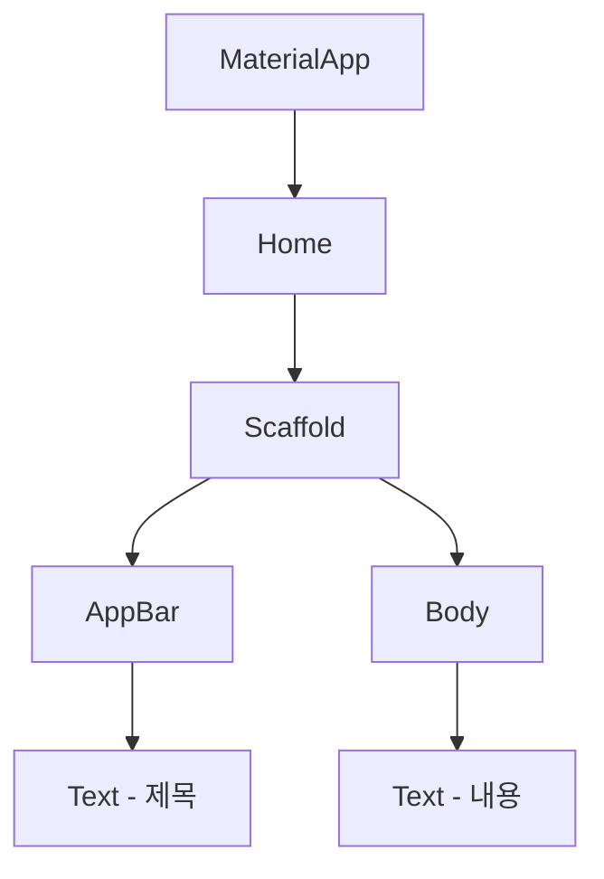

### Flutter Layout - 첫 플러터 앱 만들어보기


### - UI 만들어보기

- 플러터란?

 - 위젯이란?

 - 기본 위젯 사용해보기

 - 변경 없는 위젯(statelessWidget) vs 변경 있는 위젯(staefuleWidget)


### 1. 플러터란?

플러터는 구글에서 만든 프레임워크입니다. 크로스 플랫폼 개발을 쉽게 할 수 있게 해줍니다. 

직접 써보니 상당히 생산성이 높아서 플러터를 집중적으로 공부하고 있습니다. 

플러터의 가장 큰 특징은 UI까지 모두 코드로 작성한다는 점입니다. 

iOS의 스토리보드나 안드로이드의 xml의 경우 다른 데서 UI를 만들고, 

앱 상에서는 UI를 불러오는 방식으로 코딩을 했는데요.

플러터는 다릅니다. 

아주 간단한 플러터 코드를 보도록 하죠.

```dart
import 'package:flutter/material.dart';

void main() => runApp(new MyApp()); // 앱 실행 

class MyApp extends StatelessWidget { // 상태 변경이 없는 위젯. 한번 UI가 그려지면 그대로 있음.
  @override
  Widget build(BuildContext context) { // UI를 만드는 부분. 
    return new MaterialApp( // 구글 기본 디자인인 Material Design을 써서 앱을 만든다. 
      title: '플러터 앱', 
      home: Scaffold(
          appBar: AppBar(title: Text("타이틀")), // 앱의 상단 타이틀
          body : Text("첫 플러터 앱") // 앱 화면에 표시되는 텍스트
      ),
    );
  }
}
```

UI를 만드는 코드가 *MaterialApp()* 안에 들어 있습니다. 

*Scaffold()*,  *AppBar()* , *Text()* 등 UI 관련 코드를 바로 쓰고 있습니다. 이것들이 하는 일은 밑에서 설명할께요.

코드로 UI를 만들다보니 처음에는 정신없을 수 있는데 

익숙해질수록 빠르게 작업을 할 수 있습니다. 

한번 실행을 해볼까요?

깔끔한 UI가 나오네요.


한번 코드를 간단히 수정하고 다시 실행을 해볼께요. 

*AppBar* 와 *Text* 의 내용만 바꿔보도록 할께요.

```dart
class MyApp extends StatelessWidget {
  @override
  Widget build(BuildContext context) {
    return new MaterialApp(
      title: '플러터 앱', 
      debugShowCheckedModeBanner: false, // debug 표시를 보지 않습니다. 
      home: Scaffold(
          appBar: AppBar(title: Text("앱 타이틀")),
          body : Text("나의 첫 플러터 앱")
      ),
    );
  }
}
```


저장을 하면 바로 내용이 바뀌는 걸 알 수 있죠. 

이렇게 바뀐 걸 바로바로 앱에 반영할 수 있는 게 플러터의 가장 큰 장점입니다. 

### 2. 위젯이란?

간단히 말해 플러터 앱에 있는 모든 게 위젯이라 생각하면 되요. 텍스트, 버튼, 화면구성(레이아웃), 전체 뼈대 모든 게 위젯이죠. 

위에서 잠깐 본 머터리얼앱(MaterialApp), 스캐폴드 (Scaffold), 텍스트(Text) 모두 다 위젯이에요.

플러터는 위젯 안에 위젯을 넣는 방식으로 앱을 만들어요. 

가장 바깥의 위젯을 그리고, 안에 있는 위젯은 다음에 그리며 UI를 만들어가죠. 


위젯의 구조는 뒤집어진 나무와 비슷하답니다. 머터리얼 앱이 가장 위에 있고, 나중에 붙은 위젯이 아래에 있죠. 

아래 그림을 볼까요?



그림을 보면 머터리얼앱이 꼭대기에 있고, 텍스트들이 가장 밑에 있죠. 

지금은 텍스트 위젯을 몇개 안 더했지만, 필요에 따라 얼마든지 위젯을 더해줄 수 있습니다. 

위젯을 간단히 정리해볼께요.

**위젯 = UI를 만드는 기본 단위**

**위젯 = 안에서 밖으로 하나씩 더해준다. **

위젯이 하는 일은 꼭 기억하도록 합시다!


#### 2.1. 머터리얼앱, 스캐폴드는 어디에 쓸까

바로 텍스트 위젯을 쓰면 편할텐데 머터리얼앱이랑 스캐폴드로 감싸고 있죠. 

둘 다 구글 머터리얼 디자인을 쓰기 위해서 필요합니다. 

* 머터리얼앱 (MaterialApp) - 구글 머터리얼 디자인을 쓰겠단 뜻이에요. 전체 앱의 테마, 색깔등을 정할 수 있습니다. 

* 스캐폴드 (Scaffold) - 기본적인 머터리얼 디자인 구조를 잡아줍니다. 뼈대라고 보시면 되요. 


#### 2.2. 다른 위젯 넣어보기 - 아이콘(Icon)

Text 위젯 대신에 다른 위젯을 써보도록 해요. 

*Icon()* 위젯을 써보도록 할께요.

```
body : Icon(Icons.send, color: Colors.blueAccent) // 원하는 아이콘을 지정, 색도 바꿀 수 있습니다.
```

아이콘이 화면이 뜨네요! 

플러터는 여러 아이콘들을 기본적으로 갖고 있어서 빠르게 앱을 만들때 좋습니다. 

#### 2.3. 다른 위젯 넣어보기 - 이미지(Image)

아이콘 대신 이미지를 보여주는 위젯을 써보도록 할께요.

```dart
void main() => runApp(new MyApp());

class MyApp extends StatelessWidget {
  @override
  Widget build(BuildContext context) {
    var imageUrl = "https://images.pexels.com/photos/912110/pexels-photo-912110.jpeg?auto=compress&cs=tinysrgb&dpr=2&h=650&w=940";

    return new MaterialApp(
      title: '플러터 앱',
      debugShowCheckedModeBanner: false,
      home: Scaffold(
          appBar: AppBar(title: Text("앱 타이틀")),
          body : Image.network(imageUrl) // 이미지 보여주기 
      ),
    );
  }
}
```

(이미지 출처 : https://images.pexels.com/ , 라이센스 없는 이미지)


웹상에서 이미지를 받아서 보여주고 있습니다. 

*Image.network()* 에서 이미지 처리를 하고 있네요. 


#### 2.4. 여러 위젯 같이 써보기

위젯 안에 여러 위젯을 넣을 수도 있습니다. 

어떤 위젯 안에 넣느냐에 따라 가로로 놓이기도 하고, 세로로 놓이기도 합니다. 

##### Column - 세로로 위젯 추가하기 

Column 위젯을 쓰면 안에 있는 위젯이 세로로 배치됩니다.

칼럼 위젯을 바깥에 두고, 그 안에 텍스트, 아이콘 위젯을 넣었습니다. 

```dart
class MyApp extends StatelessWidget {
  @override
  Widget build(BuildContext context) {
    return new MaterialApp(
      title: '플러터 앱',
      debugShowCheckedModeBanner: false,
      home: Scaffold(
          appBar: AppBar(title: Text("앱 타이틀")),
          body : Column( // 위젯을 세로로 배치.
            children: <Widget>[
              Text("나의 첫 플러터 앱"),
              Text("이제 앱 개발 해보자"),
              Icon(Icons.videocam, color: Colors.amber)
            ],
          )
      ),
    );
  }
}
```

### 


텍스트, 텍스트, 위젯 세로 순으로 나오네요. 

가로로도 위젯을 배치해보죠.


##### Row - 가로로 위젯 보여주기

Column이 있던 부분을 Row로 바꿔줍시다!

```dart
import 'package:flutter/material.dart';

void main() => runApp(new MyApp());

class MyApp extends StatelessWidget {
  @override
  Widget build(BuildContext context) {
    return new MaterialApp(
      title: '플러터 앱',
      debugShowCheckedModeBanner: false,
      home: Scaffold(
          appBar: AppBar(title: Text("앱 타이틀")),
          body : Row (
            mainAxisAlignment: MainAxisAlignment.spaceAround, // 주 방향(여기서는 Row니 가로입니다)으로 어떻게 위젯을 배열할지 정합니다. MainAxisAlignment.spaceAround는 위젯의 간격이 서로 일정하게 벌려주는 걸 말합니다.
            children: <Widget>[
              Text("나의 첫 플러터 앱"),
              Text("이제 앱 개발 해보자"),
              Icon(Icons.videocam, color: Colors.amber),
            ],
          )
      ),
    );
  }
}
```


Column에서 Row로 바꾸니 바로 위젯의 위치가 바뀌었네요.

이처럼 플러터에서는 어떤 위젯을 쓰느냐에 따라 다른 결과가 나옵니다. 

위젯들의 차이를 아는 게  플러터를 잘 배우는 지름길이에요.


###3.  상태 변경 없는 위젯(statelessWidget) vs 상태 변경 있는 위젯(staefuleWidget)

여태까지 위젯은 단순히 글자나 그림을 보여주고 끝났습니다. 버튼을 누르거나 텍스트를 수정할 일은 없었죠. 

한번 버튼을 써보도록 할까요?

버튼을 누르면 텍스트 위젯의 값이 바뀌도록 하는 코드를 작성해보겠습니다. 

*RaisedButton()* 이 버튼을 만들 때 쓰입니다. 

##### 3.1 Stateless 위젯에 버튼 넣어보기

```dart
class MyApp extends StatelessWidget { // 상태 변경이 없는 위젯. 한번 UI가 그려지면 그대로 있음.
  int counter = 0;

  void increaseCounter() {
    counter++;
  }

  @override
  Widget build(BuildContext context) {
    return MaterialApp(
      title: "첫 플러터 앱",
      home: Scaffold(
        appBar: AppBar(
          title: Text("내 플러터 앱"),
        ),
        body: Container( // 컨테이너에 넣어서 마진이나 패딩을 주도록 함
          child: Column( // 세로로 위젯들을 배열
            children: <Widget>[
              Text("$counter"),
              RaisedButton( // 버튼 위젯
                child: Text(
                  "Add $counter",
                  style: TextStyle(color: Colors.white), // 텍스트의 색은 하얀색으로.
                ),
                color: Colors.red,
                onPressed: () { // 클릭할 때마다 counter변수가 변하도록 한다. 
                  increaseCounter();
                },
              ),
            ],
          ),
        ),
      ),
    );
  }
}
```

아무리 버튼을 눌러도 바뀌는 게 없죠?

*StatelessWidget* 을 써서 위젯이 바뀌지 않는 거에요.

위젯이 변하는 경우에는 *StatefulWidget* 을 써야합니다. 

위젯이 변하는 경우는 텍스트를 수정하거나, 버튼을 누르거나, 리스트 뷰를 업데이트 하거나 하는 등 다양한 경우가 있어요. 


플러터는 위젯의 변화를 스테이트(State)를 통해서 확인합니다. 스테이트가 변하면 위젯이 바뀌었는지 보고, UI를 업데이트 합니다. 

###### 3.2. Stateful 위젯 만들어보기

스테이트풀 위젯은 2개로 나뉘어요. 스테이트랑 위젯 부분인데요. 

실제 UI를 그리는 코드는 스테이트쪽에 있습니다. 

기존의 StatelessWidget과 유사하지만, 스테이트랑 위젯을 나눠서 변화하는 부분을 따로 관리하는 게 특징입니다. 

``` dart
class MyApp extends StatefulWidget { // 위젯 부분, 스테이트를 다루는 부분은 분리되어 있다. 
  @override
  _MyAppState createState() => _MyAppState();
}

class _MyAppState extends State<MyApp> { // 스테이트를 관리하고, UI를 그리는 부분. 
  @override
  Widget build(BuildContext context) {
    return MaterialApp(
      title: "첫 Stateful App",
      home: Scaffold(
        appBar: AppBar(
          title: Text("내 Stateful Widget"),
        ),
        body: Container(
          child: Text("Stateful Widget"),
        ),
      ),
    );
  }
}
```

대략적인 구조를 파악했으니 버튼을 추가해보겠습니다.

##### 예시 - 버튼을 통한 텍스트 변경

버튼을 누를 때마다 텍스트가 바뀌는 앱을 만들어볼께요. 

*Text* 하나와 *RaiseButton* 두개가 들어갑니다. 

```dart
class MyApp extends StatefulWidget {
  @override
  _MyAppState createState() => _MyAppState();
}

class _MyAppState extends State<MyApp> {
  int counter = 0; // Text UI에 표시될 값

  void increaseCounter() { // 버튼을 누르면 counter 값을 증가시킴
    setState(() {
      counter++;
    });
  }

  void decreaseCounter() { // 버튼을 누르면 counter 값을 감소시킴
    setState(() {
      counter--;
    });
  }

  @override
  Widget build(BuildContext context) {
    return MaterialApp(
      title: "첫 플러터 앱",
      home: Scaffold(
        appBar: AppBar(
          title: Text("내 플러터 앱"),
        ),
        body: Container(
          padding: const EdgeInsets.all(16.0), // 전체적으로 16씩 패딩을 주었음.
          child: Column( // 세로로 위젯을 배치 
            children: <Widget>[
              Text(
                "$counter",
                style: TextStyle(fontSize: 160.0),
              ),
              Row( // 가로로 위젯을 배치, 안에 버튼 2개가 들어가 있음. 
                mainAxisAlignment: MainAxisAlignment.spaceEvenly, // 위젯끼리 같은 공간만큼 띄움
                children: <Widget>[
                  RaisedButton(
                    child: Text(
                      "Add",
                      style: TextStyle(color: Colors.white),
                    ),
                    color: Colors.red, // 버튼 색은 빨강색으로
                    onPressed: () { // 버튼을 누르면 안에 있는 함수를 실행
                      increaseCounter();
                    },
                  ),
                  RaisedButton(
                    child: Text(
                      "Subtract",
                      style: TextStyle(color: Colors.white),
                    ),
                    color: Colors.blue, // 버튼 색은 파란색으로
                    onPressed: () { // 버튼을 누르면 안에 있는 함수를 실행
                      decreaseCounter();
                    },
                  ),
                ],
              )
            ],
          ),
        ),
      ),
    );
  }
}
```

 

실행을 하면 아래와 같이 나옵니다. 


Add버튼과 Subtract 버튼을 눌러보세요.

Text 값이 변합니다. 

이처럼 위젯의 값이 바뀌는 경우는 꼭 *StatefulWidget* 을 써줘야합니다. 


### 마무리

오늘은 기초 플러터 앱 만드는 법을 알아보았습니다. 

시작인만큼 조급해 하지말고 차근차근 기능을 더하다보면 

더 유용한 앱도 만들 수 있습니다. 

다음에는 레이아웃에 대해 알아보도록 할께요.