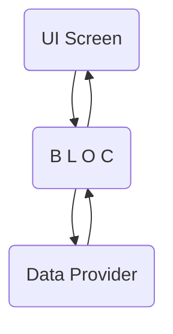

플러터에서 리액티브 프로그래밍 - Stream, Bloc 패턴

- 리액티브 프로그래밍 정의
- 스트림 써보기
- 스트림 플러터에서 써보기
- 블록 패턴 적용해보기


### 플러터에서의 리액티브 프로그래밍

요즘 프로그래밍의 대세는 반응형 프로그래밍(Reactive Programming)입니다. 

반응형 프로그래밍은 비동기 데이터 처리를 효율적으로 하기 위해 만들어졌습니다. 

비동기 처리는 데이터가 언제 도착할지 모르는 http 호출이나, UI 클릭, 데이터 저장, 에러 처리 등을 할 때 쓰입니다. 

플러터에서도 반응형 프로그래밍을 할 수 있습니다. 보통 *Stream*이나 *RxDart*를 써서 합니다. 


### Stream, StreamController

스트림은 데이터가 들어오고 나가는 통로에요. 

데이터가 변하는 걸 보고 있다가 그에 맞춰 적절한 처리를 하죠. 필터링(where)이나 수정(map), 버퍼링(take) 같은 일을 합니다.

스트림 컨트롤러는 여러 스트림을 관리하는 데 쓰여요. 

데이터가 추가되거나 이벤트가 종료되거나 할때 스트림 컨트롤러를 써서 처리해줄 수 있습니다.

스트림 컨트롤러를 쓰는 예제를 보도록 할께요.

스트림 컨트롤러에 데이터가 추가될때마다 출력하도록 했습니다. 

```dart
void main() {
  StreamController ctrl = StreamController();

  ctrl.stream.listen((data) {
    print(data);
  });

  ctrl.add(10);
  ctrl.add("Good morning");
  ctrl.add({"age": 50, "name": "Youngmi"});

  ctrl.close();
}
```

실행결과

``` 
10
Good morning
{age: 50, name: Youngmi}
```


간단히 데이터를 출력만 해주고 있습니다. 

그럼 스트림을 플러터에서 어떻게 쓸까요?

스트림 빌더(StreamBuilder)를 써서 스트림 처리를 해요. 

스트림 빌더를 쓰면 *setState()* 를 쓰지 않고도 UI를 업데이트 할 수 있습니다. 

또 항상 스트림의 최신값을 가져오니, 최신값을 확인할 필요가 없습니다.

이제 실제 플러터에서 스트림 빌더를 어떻게 쓰는지 볼까요.


##### 예제 1 - 스트림 빌더로 간단한 UI 만들어보기 

스트림 빌더를 써서 UI 2개를 만들어볼께요.

##### -  1. 버튼을 누를때 텍스트가 바뀌는 UI

##### -  2. 타이머로 1초마다 알아서 텍스트가 바뀌는 UI


###### 예제1 - 완성 후 모습


###### 예제1 -  코드

```dart
import 'dart:async';
import 'package:flutter/material.dart';

void main() => runApp(new MyApp());

class MyApp extends StatelessWidget {
  // This widget is the root of your application.
  @override
  Widget build(BuildContext context) {
    return new MaterialApp(
      title: 'Flutter Demo',
      theme: new ThemeData(
        primarySwatch: Colors.blue,
      ),
      home: CounterPage()
    );
  }
}

class CounterPage extends StatefulWidget {
  @override
  _CounterPageState createState() => _CounterPageState();
}

class _CounterPageState extends State<CounterPage> {
  int _counter = 0;
  final StreamController<int> _streamController = StreamController();
  final StreamController<int> _ctrl = StreamController();
  final Stream<int> stream = Stream.periodic(Duration(seconds: 1), (int x) => x); // 1초에 한번씩 업데이트

  @override
  Widget build(BuildContext context) {
    return Scaffold(
      appBar: AppBar(title: Text('Stream version of the Counter App')),
      body: Center(
        child: Column(
          children: <Widget>[
            Text("Hello"),
            // 1. 버튼 누를 때마다 텍스트 변경  
            StreamBuilder<int>(
                stream: _streamController.stream, // 어떤 스트림을 쓸지 정함
                initialData: _counter, // 초기값 정하기, 스트림에 값이 없을지도 모르니 초기값을 정함.
                builder: (BuildContext context, AsyncSnapshot<int> snapshot) { // UI 만드는 부분.
                  return Text('You hit me ${snapshot.data} times'); 
                },
            ),
            // 2. 1초마다 텍스트 변경
            StreamBuilder<int> (
              stream: stream, //
              builder: (BuildContext context, AsyncSnapshot<int> snapshot) {
                return Text('${snapshot.data} seconds passed'); // 1초에 한번씩 업데이트 된다. 
              },
            )
          ],
        ),
      ),
      floatingActionButton: FloatingActionButton(
        child: const Icon(Icons.add),
        onPressed: () {
          _streamController.sink.add(++_counter);
        },
      ),
    );
  }
}
```


위 예제에선 스트림을 2개 써보았어요.

하나는 버튼을 누를 때마다 텍스트가 변경될 때 쓰였고,

다른 하나는 1초마다 자동으로 텍스트가 업데이트 되도록 하였습니다.

굳이 *setState()*로 값이 변경되었다는 걸 알려주지 않아도 알아서 텍스트가 바뀝니다. 

UI를 다룰 때나, 네트워크 처리를 할 때 정말 유용하겠죠?

이번엔 서버에서 데이터를 가져와 스트림 빌더로 파싱하는 예제를 만들어볼께요. 

https://jsonplaceholder.typicode.com/todos 에 있는 데이터를 쓰도록 하겠습니다.


##### 예제 2 - 스트림 빌더로 TodoList만들기

이번엔 TodoList를 만들어보겠습니다. 

서버에서 데이터를 가져와서 TodoList를 만드는 예제에요.

###### 완성 후 모습


일단 Todo 데이터를 담을 클래스를 만들어 볼께요.

https://jsonplaceholder.typicode.com/todos/1 를 

http request 하면 아래처럼 응답이 옵니다.

```json
{
	userId: 1,
	id: 1,
	title: "delectus aut autem",
	completed: false
},
```

4개의 값이 응답 왔네요. 

이에 맞게 Todo클래스를 만들어주겠습니다. 

json처리를 위한 생성자를 추가적으로 만들었습니다!

```dart
class Todo {
  int userId;
  int id;
  String title;
  bool completed;

  Todo(this.userId, this.id, this.title, this.completed);

  Todo.fromJson(Map json) // named constructor
    : userId = json['userId'],
      id = json['id'],
      title = json['title'],
      completed = json['completed'];
}
```

이젠 UI 부분을 작업해볼께요. 버튼을 누르면 json 데이터를 서버에서 가져와 스트림 빌더에서 그려주는 구조입니다. 

스트림 빌더는 stream과 builder 부분으로 구성되어 있습니다. 

stream은 스트림 빌더에 쓰일 스트림을 정하는 일을 하고

 builder에서 스트림 데이터를 받아 UI 를 그리는 일을 합니다. 

```dart
StreamBuilder(
     stream: streamController.stream, // 스트림 빌더에서 쓰일 스트림을 지정
     builder: (BuildContext context, AsyncSnapshot snapshot) {
			if (snapshot.hasData) { // 스냅샷에 데이터가 있는지 확인
                 return Text("data");
            } 
     }     
),
```


###### 예제2 - TodoList 전체 코드

```dart
import 'dart:async';
import 'dart:convert';
import 'package:http/http.dart' as http;
import 'package:flutter/material.dart';

class TodoListPage extends StatefulWidget {
  @override
  _TodoListPageState createState() => _TodoListPageState();
}

class _TodoListPageState extends State<TodoListPage> {
  StreamController<List<Todo>> streamController = StreamController(); // 데이터를 받아들이는 스트림.

  Future<List<Todo>> getTodo() async {
    String url = "https://jsonplaceholder.typicode.com/todos"; // http request를 보낼 url

    http.Client _client = http.Client(); // http 클라이언트 사용

    List<Todo> list = [];

    await _client.get(url) // http 리퀘스트를 보낸다.
    .then((res) => res.body) // http 응답을 받으면, 그 중에서 body만 가져옴
    .then(json.decode) // json을 형태로 파싱하고
    .then((todos) =>
        todos.forEach((todo) => list.add(Todo.fromJson(todo))) // json을 클래스 형태로 바꿔서 리스트에 더해준다.
    );

    return list;
  }

  Widget _buildListTile (AsyncSnapshot snapshot, int index) { // 리스트 뷰에 들어갈 타일(작은 리스트뷰)를 만든다.
    var id = snapshot.data[index].id; 
    var title = snapshot.data[index].title;
    bool completed = snapshot.data[index].completed;

    return ListTile(
      leading: Text("$id"),
      title: Text("$title"),
      subtitle: Text("completed ",
        style: TextStyle(color: completed ? Colors.lightBlue : Colors.red),
      ),
    );
  }

  @override
  Widget build(BuildContext context) {
    return Scaffold(
        appBar: AppBar(title: Text("Todo List")),
        body: Column(
          children: <Widget>[
            Center(
              child: RaisedButton(
                child: Text("Load"),
                color: Colors.lightBlueAccent,
                textColor: Colors.white,
                onPressed: () { // 버튼을 누르면 서버에서 데이터를 가져옴
                    
                  getTodo().then((todos) {
                    streamController.add(todos); // 스트림 컨트롤러에 데이터가 추가된다. 
                  });
                    
                },
              ),
            ),
            Flexible(
              child: StreamBuilder(
                stream: streamController.stream,
                builder: (BuildContext context, AsyncSnapshot snapshot) {
                  if (!snapshot.hasData) { // 스냅샷에 데이터가 없으면 그냥 텍스트를 그린다.
                    return Text("no data");
                  } else { // 스냅샷에 데이터가 있으면, 즉 스트림에 데이터가 추가되면 리스트뷰를 그린다. 
                    return ListView.builder(
                        itemCount: snapshot.data.length, // 스냅샷의 데이터 크기만큼 뷰 크기를 정한다. 
                        itemBuilder: (context, index) => _buildListTile(snapshot, index),
                    );
                  }
                },
              ),
            ),
          ],
        ));
  }
}
```

이제 실행해볼까요?

```dart
import 'package:flutter/material.dart';
import 'todolist_page.dart';

void main() => runApp(new MyApp());

class MyApp extends StatelessWidget {
  // This widget is the root of your application.
  @override
  Widget build(BuildContext context) {
    return new MaterialApp(
      title: 'Flutter Demo',
      theme: new ThemeData(
        primarySwatch: Colors.blue,
      ),
      home: TodoListPage(),
    );
  }
}
```


화면 상단의 Load 버튼을 누르면 json파일을 서버에서 불러와서 보여줍니다. 

매끄럽게 처리가 되죠?

스트림을 쓰면 비동기 데이터를 다루는 일이 한결 편해지는 걸 알 수 있습니다. 

다만 아쉬운 점은 스트림과 스트림 빌더가 앱에 추가되다 보니, UI 코드와 섞인단 거죠.

앱의 크기가 커질수록 UI와 데이터 부분이 더 많이 섞이겠죠. 

이 문제를 해결하기 위해선 UI와 데이터 처리 부분을 분리해줘야합니다. 


### Bloc 패턴

Bloc은 비즈니스 로직 컴포턴트(Business Logic Component)의 약자입니다. 

- Bloc 패턴이 쓰이는 이유?
  - UI와 비즈니스 로직을 분리해 개발을 원활히 하고자 함입니다.
  - 비즈니스 로직은 데이터베이스 조회나 서버와의 통신 등 데이터를 처리하는 부분을 말합니다.

  - UI와 비즈니스 로직을 분리하면, UI를 수정하는 일이 비즈니스 로직에 영향을 미치지 않고 비즈니스 로직의 변경이 UI에 영향을 미치지 않게 됩니다. 테스트가 용이해지고,  UI의 변경이 손쉬워집니다. 또한 위젯 *build* 횟수가 줄어들게 됩니다. 성능면에서도 이점이 있죠. 
  - 기존의 MVC와 유사합니다.


###### Bloc 패턴 그림 




##### Bloc 패턴을 앱에다 어떻게 적용할까?

앱에 블락 패턴을 쓰려면 3가지를 해야합니다. 

1. Bloc을 만들고 필요한 로직을 구현한다. 

2. BlocProvider을 만든다. BlocProvider는 로직(Bloc)을 UI에 건내주기만 합니다. Provider(제공자)란 이름에 맞는 역할이지요. 

3. BlocProvider를 통해 건내받은 Bloc을 StreamBuilder와 연결합니다. 


실제 Bloc 패턴이 어떻게 쓰이는지 위에서 만든 TodoList 앱을 통해서 설명해볼께요.

##### 예제3. TodoList 만들기 - Bloc패턴 적용

예제3의 소스는 [여기 - github](https://github.com/Hochul822/bloc_pattern) 서 확인하실 수 있습니다.

폴더 구조는 다음과 같습니다. 


UI, Bloc, Data를 다 분리해주었습니다.

일단 Todo 데이터를 담을 클래스를 만들어줍니다. 

여기까지는 이전 예제와 큰 차이는 없습니다.

###### todo.dart

```dart
class Todo {
  int userId;
  int id;
  String title;
  bool completed;

  Todo(this.userId, this.id, this.title, this.completed);

  Todo.fromJson(Map json)
      : userId = json['userId'],
        id = json['id'],
        title = json['title'],
        completed = json['completed'];
}
```

json 데이터를 가져오는 api를 만들어볼께요.

###### api.dart

```dart
import 'dart:async';
import 'dart:convert';
import 'package:http/http.dart' as http;

import '../model/todo.dart';

class API {
  final http.Client _client = http.Client();

  static const String _url = "https://jsonplaceholder.typicode.com/todos";

  Future<List<Todo>> getTodo() async {
    List<Todo> list = [];

    await _client
        .get(Uri.parse(_url))
        .then((res) => res.body)
        .then(json.decode)
        .then((todos) =>
            todos.forEach((todo) => list.add(Todo.fromJson(todo))
            ));

    return list;
  }
}
```

Bloc 부분이에요.

데이터를 가져오면 그걸 스트림에 더해줍니다. 

이전 예제에서는 UI 부분이랑 섞여 있는 걸 분리했습니다.

######  todo_bloc.dart

```dart
import 'dart:async';
import '../model/todo.dart';
import '../repository/api.dart';

class TodoBloc {

  final API api;

  StreamController<List<Todo>> ctrl = StreamController();

  Stream<List<Todo>> get results => ctrl.stream; // 바로 스트림에 접근하지 않기 위해 만들었습니다.

  TodoBloc(this.api);
  
  void dispose() { 
    ctrl.close(); // 스트림은 안 쓸 때 닫아줘야합니다. 
  }

  void getTodo() {
    api.getTodo().then((todos) {
      ctrl.add(todos);
    });
  }
}
```

이제 Provider를 만들어볼께요. 

Bloc은 항상 Provider를 통해서 사용합니다. 

Provider는 *InheritedWidget*을 상속받습니다. 

InheritedWidget을 쓰면 자식 위젯에서도 접근할 수 있기에, Bloc을 어디서나 접근할 수 있게 하려고 InheritedWidget을 썼습니다. 

###### TodoProvider.dart

```dart
import 'package:flutter/material.dart';
import 'todo_bloc.dart';
import '../repository/api.dart';

class TodoProvider extends InheritedWidget { // 자식 위젯에서 접근하기 위함
  final TodoBloc todoBloc;

  @override
  bool updateShouldNotify(InheritedWidget oldWidget) => true;

  static TodoBloc of(BuildContext context) =>
      (context.inheritFromWidgetOfExactType(TodoProvider) as TodoProvider).todoBloc; // static으로 해서 1번만 초기화하도록 함. 

  TodoProvider({Key key , TodoBloc todoBloc, Widget child })
    : this.todoBloc = todoBloc ?? TodoBloc(API()),
      super(child: child, key: key);
}
```


이제 UI 부분을 만들어볼께요. 

TodoList를 그리는 화면이고, StreamBuilder를 사용했습니다. 

todo_page.dart

```dart
import 'package:flutter/material.dart';

import '../bloc/todo_provider.dart';

class TodoPage extends StatefulWidget {
  @override
  _TodoPageState createState() => _TodoPageState();
}

class _TodoPageState extends State<TodoPage> {

  Widget _buildListTile (AsyncSnapshot snapshot, int index) {
    var id = snapshot.data[index].id;
    var title = snapshot.data[index].title;
    bool completed = snapshot.data[index].completed;

    return ListTile(
      leading: Text("$id"),
      title: Text("$title"),
      subtitle: Text("completed ",
        style: TextStyle(color: completed ? Colors.lightBlue : Colors.red),
      ),
    );
  }

  @override
  Widget build(BuildContext context) {
    final todoBloc = TodoProvider.of(context);

    return Scaffold(
      appBar: AppBar(title: Text("Title")),
      body: Center(
        child: Column(
          children: <Widget>[
            Text("Stream Builder with Bloc"),
            RaisedButton(
                color: Colors.lightBlueAccent[200],
                child: Text(
                  "Load Data",
                  style: TextStyle(color: Colors.white),
                ),
                onPressed: () {
                  todoBloc.getTodo();
                }),
            Flexible(
              child: StreamBuilder(
                stream: todoBloc.results,
                builder: (context, snapshot) {
                  if (!snapshot.hasData) {
                    return Text("No data");
                  } else {
                    return ListView.builder(
                      itemCount: snapshot.data.length,
                      itemBuilder: (context, index) => _buildListTile(snapshot, index),
                    );
                  }
                },
              ),
            )
          ],
        ),
      ),
    );
  }
}
```


마지막 메인 부분입니다. 

*MaterialApp* 을 *TodoProvider*가 감싸고 있는데, 

Bloc을 어디서나 쓸 수 있도록 하기 위함입니다. 

```dart
import 'package:flutter/material.dart';

import 'ui/todo_page.dart';
import 'bloc/todo_provider.dart';
import 'bloc/todo_bloc.dart';
import 'repository/api.dart';

void main() => runApp(new MyApp());

class MyApp extends StatelessWidget {
  // This widget is the root of your application.
  @override
  Widget build(BuildContext context) {
    return TodoProvider(
      todoBloc: TodoBloc(API()),
      child: MaterialApp(
        debugShowCheckedModeBanner: false,
        title: 'Flutter Demo',
        theme: ThemeData(primarySwatch: Colors.blue),
        home: TodoPage(),
      ),
    );
  }
}
```


실행을 해볼까요?

실행 결과는 예제2와 동일합니다.

하지만 UI코드를 분리하다보니 코드가 간결해진 걸 알 수 있습니다. 

이처럼 Bloc 패턴을 활용하면 보기 좋고, 깔끔한 코드를 만들 수 있습니다. 

### 마무리

리액티브 프로그래밍은 플러터에서도 예외는 아니었습니다. 

저도 처음엔 왜 쓰나 했는데 적응 될 수록 코드가 간결해지는 맛이 있더군요. 

하지만 처음 플러터를 배울 때부터 Bloc 패턴을 적용하는 건 무리가 있단 생각이 드네요. 

처음에는 한 클래스에 넣다가, UI와 로직을 분리하고픈 생각이 들면 그때 Bloc패턴을 적용해봅시다!

--

참고

- [리액티브 프로그래밍과 Bloc](https://www.didierboelens.com/2018/08/reactive-programming---streams---bloc/)
- [tensor programming의 유튜브 강의](https://www.youtube.com/watch?v=ALcbTxz3bUw&t=1s)

