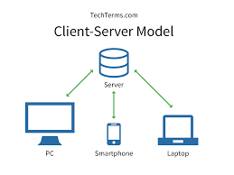
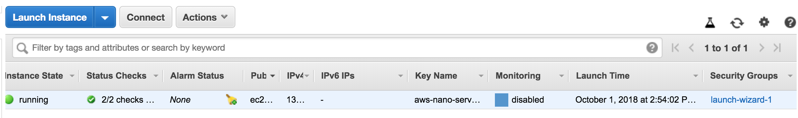
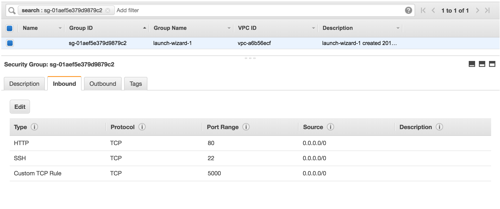
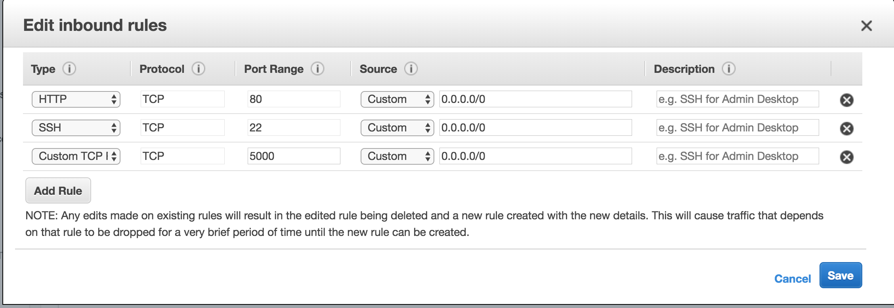

### 플라스크

- flask 설치
  - auto reload
- route
- http method
- sql과 연결
- 배포
  - aws


### 플라스크로 웹서버 배우기   

##### 클라이언트 - 서버


##### 웹 프레임워크
- 웹 프레임워크는 쓰레드나 프로토콜처럼 복잡한 부분을 신경쓰지 않고 웹 애플리케이션을 만들 수 있는 라이브러리, 모듈의 모음을 말합니다.
- 대표적인 웹 프레임워크
  - Flask
    - 가볍다(light weight), 쉽게 시작할 수 있다.
    - 필요한 기능을 다 만들어야함
  - Django
    - 복잡함.
    - 커뮤니티가 방대함
    - 상당수 기능을 제공함(게시판, 관리자 페이지, 로그인, 보안 등)
  - Tornado
    - 설명이 많지 않음.
    - 성능이 뛰어나다.
    - 비동기 앱 만들때 유리함.


플라스크는 학습곡선에 낮아서 처음 배우기에 무척 좋다!

##### Flask 설치
```
pip install Flask
```

##### 가상환경(virtual enviroment)
- 파이썬은 다수의 라이브러리를 설치해서 쓰는 데, 여러 프로젝트를 할 때는 라이브러리를 분리해주는 게 편리하다.

- python 2.7에서는 virtualenv로 가상환경을 만든다

- 가상환경 만들기
```
virtualenv py-env
source py-env/bin/activate
```

성공시 터미널이 아래처럼 바뀐다.  
- 가상환경 활성화
```
(py-test) Home$
(py-test) Home$ pip install Flask
```

- 가상 환경에서 나오기
```
deactivate
```

##### 첫 플라스크(Flask) 앱
```python
from flask import Flask
app = Flask(__name__)

@app.route('/')
def hello_world():
  return 'Hello World'

if __name__ == '__main__':
  app.run()
```

실행을 시키고 브라우저를 써서
http://localhost:5000 에 접속해보자.

Hello World가 뜨면 성공이다.

플라스크는 10줄도 코드를 작성 안해도 간단한 웹 페이지를 만들 수 있다!

##### 라우팅 (Routing)
웹 사이트는 URL을 가지고 어떤 페이지인지 구분을 한다.

- 네이버 뉴스 페이지 : https://news.naver.com/
- 네이버 영화 페이지 :
https://movie.naver.com/

플라스크도 URL에 따라 다른 페이지를 보여주는데 이를 라우팅(Routing)이라고 한다.

라우팅할 경로를 좀 더 적어보고 직접 확인을 해보도록 하자.

```python
from flask import Flask
app = Flask(__name__)

@app.route('/')
def hello_world():
    return 'Hello World'

@app.route('/user/<username>')
def show_user_profile(username):
    return 'User %s' % username

if __name__ == '__main__':
    app.run(debug=True)

```

http://localhost:5000/user/mike 로 접속을 해보자.

**User mike** 가 화면에 나올 것이다.

이처럼 URL을 파싱해서 화면에 보여주거나, 경로를 정하는데 쓸 수 있다.

###### 라우팅 : *URL - 타입 지정*

URL에 들어갈 타입도 지정해 줄 수 있다.

- string: 기본 타입, 아무거나 다 받음
  - 정의 : ```/news/<category>```
  - 예시1 : http://localhost:5000/news/sports
  - 예시2 : http://localhost:5000/news/100

- int: 숫자 타입, 숫자 아님 에러
  - 정의 : ```post/<int:post_id>```
  - 예시1 : http://localhost:5000/post/1
  - 예시2 : http://localhost:5000/post/good  <- 에러남

- path : string이랑 동일한데, ```/``` 를 URL에 넣을 수 있음
  - 정의 : ```news/<path:category>```
  - 예시 : http://localhost:5000/news/go/od

- float : 실수, 문자쓰면 에러남


```python
@app.route('/user/<username>')
def show_user_profile(username):
    return 'User %s' % username


@app.route('/post/<int:post_id>')
def show_post(post_id):
    return 'Post %d ' % post_id    
```

###### HTTP Method

HTTP 메소드는 인터넷에서 쓰이는 동작들을 정의해 놓은 것이다.. 컴퓨터를 쓰다보면 항상 필요한 작업이 있는데 읽기, 쓰기, 수정하기, 지우기입니다. HTTP 메소드는 인터넷 상에서의 읽기, 쓰기, 수정하기, 지우기를 담당한다..

HTTP 메소드의 종류에는 GET(읽기), PUT(수정하기), POST(쓰기), DELETE(지우기)가 있다..

같은 URL로 접속을 해도 어떤 HTTP 메소스들 쓰느냐에 따라 다른 결과가 나온다.

```python
@app.route("/book", methods=['GET', 'POST', 'PUT', 'DELETE'])
def book():
    if request.method == 'GET':
        return 'BOOK GET'
    elif request.method == 'POST':
        return 'BOOK POST'
    elif request.method == 'PUT':
        return 'BOOK PUT'
    elif request.method == 'DELETE':
        return 'BOOK DELETE'
```

HTTP 메소드를 편하게 쓰려면 Postman을 쓰는 걸 권한다.

###### Postman 설치

포스트맨은 HTTP METHOD를 편리하게 쓸 수 있게 해주는 앱이다.

일일이 CURL 명령어를 입력하는 것보다 훨씬 편리하다.

https://www.getpostman.com/


###### JSON 데이터 받기
보통 웹서버에서 데이터는 JSON으로 주고 받는다.

HTTP RESPONSE에 JSON을 실어서 응답하는 코드를 작성해보자.


```python
from flask import Flask
from flask import json

app = Flask(__name__)

@app.route('/person/<id>')
def show_each_person(id):
    data = {
        "id": id,
        "name": "Hochul",
        "age": 33
    }

    res = app.response_class(
        response=json.dumps(data),
        status=200,
        mimetype='application/json'
    )

    return res

if __name__ == '__main__':
  app.run(host='0.0.0.0', debug=True)  
```

http://localhost:5000/person/1  로 접속해보자.

아래처럼 나오면 성공이다.

```json
{
    "age": 33,
    "id": "1",
    "name": "Hochul"
}
```

###### SQLite3 연결

여태까지는 데이터를 임의로 만들었는데 데이터베이스에 있는 데이터를 가져오는 걸 해보도록 하자.

sql 파일을 하나 만들어보자.

파일명은 **init.sql** 로 하겠다.

```sql
create table if not exists customers(id integer primary key not null, name text not null, age integer not null, job text);
insert into customers values(1, '철수', 33, '개발자');
insert into customers values(2, '정미', 28, '디자이너');
insert into customers values(3, '지우', 20, '대학생');
insert into customers values(4, '방석', 27, '가수');
insert into customers values(5, '영수', 44, '사업가');
insert into customers values(6, '조이', 27, '회사원');
insert into customers values(7, '수지', 51, '영업사원');
```
init.sql 파일을 sqlite3에서 실행해주도록 하자.

```
sqlite3 shopping.db < init.sql
```

이제 sqlite3에서 데이터를 조회해서 json으로 만들어보겠다.

```python
@app.route('/customers/detail/<id>', methods=['GET'])
def read_customer(id):
    with sqlite3.connect('shopping.db') as con:
        cur = con.cursor()
        cur.execute('select * from customers where id = %s' % id)

        row = cur.fetchone()

        id = row[0]
        name = row[1]
        age = row[2]
        job = row[3]

        print(row)

        data = {
            "id": id,
            "name": name,
            "age": age,
            "job": job
        }

        response = app.response_class(
            response = json.dumps(data, ensure_ascii=False),
            status = 200,
            mimetype='application/json'
        )

        return response
```


### 웹서버 배포

AWS의 EC2를 활용해 작성한 코드를 배포해 보도록 하겠다.

**1.접속하기**
```
ssh -i aws-nano-server-key.pem ubuntu@[ip주소]
```

만약 접속하려다 이런 에러가 뜬다면

```
@@@@@@@@@@@@@@@@@@@@@@@@@@@@@@@@@@@@@@@@@@@@@@@@@@@@@@@@@@@
@         WARNING: UNPROTECTED PRIVATE KEY FILE!          @
@@@@@@@@@@@@@@@@@@@@@@@@@@@@@@@@@@@@@@@@@@@@@@@@@@@@@@@@@@@
Permissions 0777 for '.ssh/my_private_key.pem' are too open.
It is required that your private key files are NOT accessible by others.
This private key will be ignored.
bad permissions: ignore key: .ssh/my_private_key.pem
Permission denied (publickey).
```

키의 권한을 바꿔주면 된다.
```
chmod 0400 .ssh/my_private_key.pem
```

**2. 웹서버 실행**

aws ec2에 접속을 해보자.
- *ssh -i 키 사용자이름@ip주소* 를 적어주면 된다.


```
ssh -i aws-nano-server-key.pem ubuntu@[ip주소] // ubuntu 인스턴스에 접속할때
ssh -i aws-nano-server-key.pem ec2-user@[ip주소] // aws linux 인스턴스에 접속할때
```

사용자 이름은 어떤 인스턴스를 쓰느냐에 따라 달라진다.  

```
Amazon Linux AMI : ec2-user
Centos AMI : centos
Debian AMI : admin 또는 root
Ubuntu AMI : ubuntu
```
접속해서 보면
일반 리눅스 환경과 유사한 걸 알 수 있다.
git에 올려놓은 플라스트 앱을 받아서 실행을 해보자.

```
git clone https://Hochul822@bitbucket.org/Hochul822/flask-start.git
cd flask-start
pip install --upgrade pip
pip install -r requirements.txt
python app.py
```

이제 외부에서 접속할 준비가 되었다.

aws의 public ip를 통해서 접속을 시도해 보자!
접속이 안 된다. 포트가 닫혀있기 때문이다.

**_포트 열기_**



Security group 탭을 눌러주자.



Inbound 탭(인바운드는 외부에서 서버로 들어오는 걸 말한다)에서 Edit를 눌러주자.


Port 5000을 추가해주자.

이제 외부에서 http://내ip주소:5000/  로 접속하면 된다!
